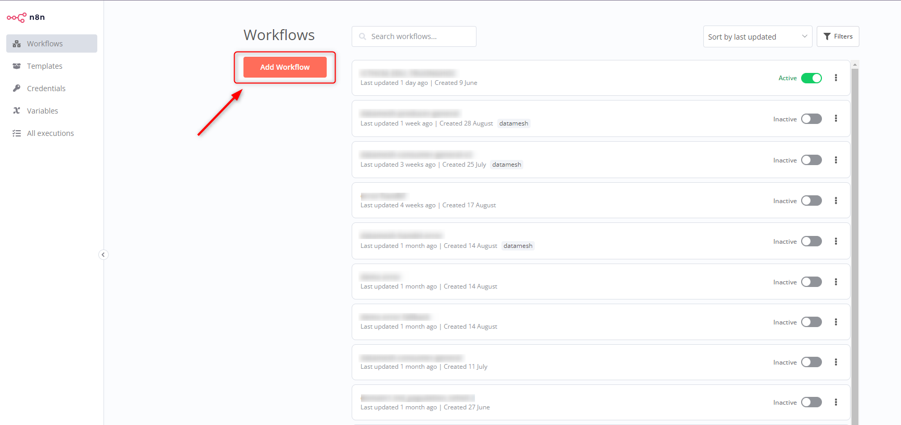
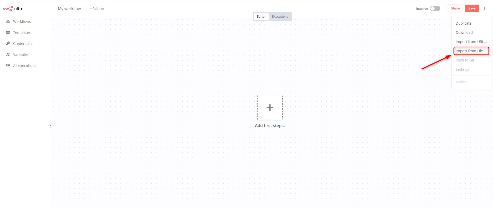
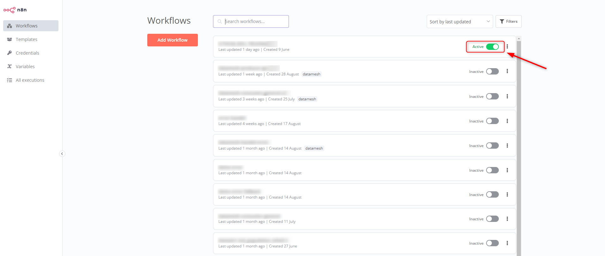

# HƯỚNG DẪN TẠO **WORKFLOW CONSUMER**

## Yêu cầu hệ thống

- N8N

## Các bước thực hiện

### 1. Tải tập tin liên quan

- Tải file [datamesh_consumer_general_v3.json]
- Tải file [datamesh_cosumer_handel_error.json]

### 2. Tạo workflow trên N8N 

### 3. Import tập tin `datamesh_consumer_general_v3.json`, `datamesh_cosumer_handel_error.json` vào workflow

### 4. Active workflow

