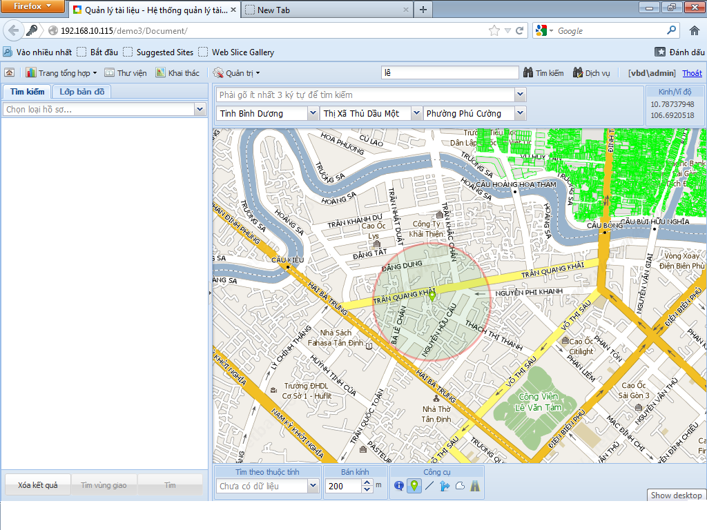
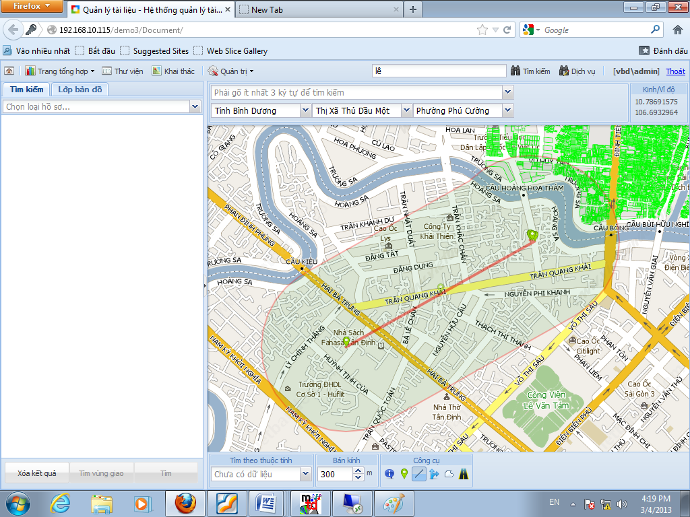
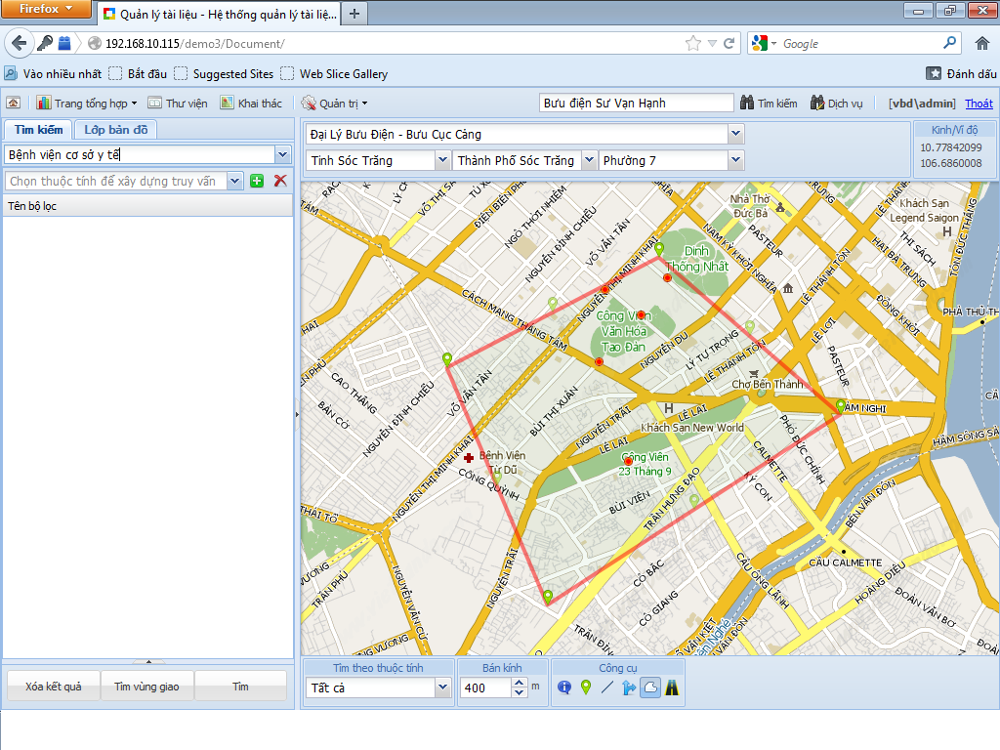

# Vietbando Search Service (VSS)

## Giới thiệu

Vietbando Search Service (VSS) là một dịch vụ cung cấp các chức năng tìm kiếm thông tin/tài liệu được xây dựng trên nền tảng mã nguồn mở Apache Lucene/Solr cùng với các phần mở rộng do Vietbando tự xây dựng.

Tính năng chính của VSS bao gồm khả năng tìm kiếm toàn văn (full text search - FTS), đặc biệt tập trung vào khả năng xử lý tìm kiếm tiếng Việt, đánh dấu (highlighting) kết quả, phân tích – thống kê trên dữ liệu, tích hợp với các hệ cơ sở dữ liệu (bao gồm SQL, NoSQL), xử lý nhiều kiểu văn bản (ví dụ: Word, PDF), tìm kiếm không gian (spatial search) và hỗ trợ phân quyền trên tài liệu. VSS có độ tin cậy cao, có khả năng tùy biến cao, mở rộng tốt bằng cách có thể làm việc trên hệ thống phân tán.

## Mô tả chức năng

### Thêm/Xóa/Sửa tài liệu

Với chức năng cung cấp một dịch vụ trọn gói về tìm kiếm thông tin/tài liệu thì chức năng thêm/xóa/sửa nội dung tài liệu là một chức năng không thể thiếu của VSS. Với chức năng này, VSS cung cấp các hàm dịch vụ giúp tạo mới các index, thêm mới các tài liệu vào hệ thống, xóa đi các tài liệu không cần thiết và sửa nội dung những tài liệu cần chỉnh sửa nội dung.

#### Thêm tài liệu

Hàm dịch vụ:

public UpdateIndexResponse Add(DocumentAddRequest request)

Trong đó, tham số input là một yêu cầu thêm tài liệu DocumentAddRequest được định nghĩa gồm các thuộc tính:

- Documents: tập các tài liệu cần được thêm vào index. Nếu index chưa có thì index sẽ được tạo ra trước.
- Key: tên của index.
- BuildAutoSuggest: cho biết có tạo dữ liệu cho Auto Suggest hay không.
- Optimize: cho biết có optimize index khi hoàn thành việc thêm tài liệu hay không.
- CommitWithin: chỉ định số thời gian (ms) các tài liệu thêm vào chắc chắn được lưu xuống đĩa cứng sau đó.

Kết quả output UpdateIndexResponse đơn giản chỉ chứa các thông tin thông báo về kết quả việc thêm tài liệu vào như thế nào, gồm có:

- Time: tổng thời gian thêm tài liệu.
- Status: tình trạng của hệ thống sau khi thêm tài liệu. Thành công hay không thành công.
- Message: các thông báo bổ sung làm rõ nghĩa cho Status hơn.

#### Xóa tài liệu

Hàm dịch vụ:

public UpdateIndexResponse Delete(DocumentDeleteRequest request)

Trong đó, tham số input là một yêu cầu thêm tài liệu DocumentDeleteRequest được định nghĩa gồm các thuộc tính:

- Documents: tập các tài liệu cần được xóa khỏi index. Index bắt buộc phải tồn tại.
- Key: tên của index.
- Optimize: cho biết có optimize index khi hoàn thành việc xóa tài liệu hay không.
- CommitWithin: chỉ định số thời gian (ms) các tài liệu sau khi xóa chắc chắn được xóa khỏi đĩa cứng sau đó.
- DeleteQuery: câu truy vấn để xóa các tài liệu nào thỏa câu truy vấn đó.
- DeleteLayer: xóa tất cả các tài liệu thuộc lớp tài liệu này.

#### Sửa tài liệu

Thực chất việc sửa tài liệu là quá trình xóa tài liệu cũ và thêm tài liệu mới sau khi chỉnh sửa nội dung.

### Sử dụng các đặc trưng của Tiếng Việt trong phân tích truy vấn trên tài liệu Tiếng Việt

#### Từ có dấu – không dấu

VSS hỗ trợ khả năng tìm kiếm bằng các truy vấn Tiếng Việt có dấu và không dấu như nhau. Điều nay được thực hiện thông qua bộ phân tích nội dung tài liệu khi trong quá trình index tài liệu.

#### Từ ghép – tên riêng

Một trong số các đặc trưng quan trọng của Tiếng Việt đó là từ ghép. Với từ ghép, việc tách từ trở nên vô cùng quan trọng bởi khi tách đôi một từ ghép ra thì nghĩa của nó sẽ hoàn toàn mất đi, không còn nguyên vẹn nữa. VSS hỗ trợ rất tốt vấn đề này khi có khả năng phát hiện các từ ghép trong nội dung tài liệu cũng như trong câu truy vấn để khi thực hiện quá trình phân tích tài liệu khi index cũng như phân tích nội dung truy vấn các từ ghép (nếu có) sẽ không bị tách rời ra (thành các Single Term) tránh bị thay đổi ý nghĩa.

Điều tương tự đối với tên riêng. Cũng như từ ghép, tên riêng là một dạng không thể tách rời các thành phần trong đó nhằm tránh thay đổi nội dung không mong muốn.

#### Từ đồng nghĩa

Nhằm cung cấp khả năng tìm kiếm tốt hơn, tăng số lượng kết quả tìm thấy phù hợp với nội dung truy vấn hơn, VSS hỗ trợ vấn đề xử lý từ đồng nghĩa trong quá trình index tài liệu. Theo đó khi index tài liệu, ứng với một từ đơn hay từ ghép được hệ thống phân tích được, hệ thống sẽ tìm các từ đồng nghĩa với nó để đưa thêm vào nội dung index.

### Tìm kiếm toàn văn

Hàm dịch vụ:

public DocSearchResponse TextSearch(DocSearchRequest request)

Trong đó, input là một yêu cầu tìm kiếm gồm các thuộc tính sau:

- Key: index sẽ tìm kiếm trên đó.
- Query: câu truy vấn.
- Rows: số kết quả tối đa được trả về trên 1 trang kết quả.
- Start: chỉ số của kết quả đầu tiên được lấy ra trong tập các kết quả hệ thống tìm thấy.
- StatRequest: yêu cầu thực hiện thống kê trên tập kết quả.

Kết quả trả về là một DocSearchResponse bao gồm các thông tin thông báo về kết quả tìm kiếm, gồm:

- Documents: tập kết quả tìm thấy. Số lượng tối đa của tập này chính là giá trị Rows được chỉ định trong input.
- TotalResult: tổng số kết quả tìm thấy.
- Time: tổng thời gian tìm kiếm.

Câu truy vấn (Query) trong nội dung input bên trên sẽ thuộc về một trong các dạng truy vấn sau:

#### Tìm kiếm theo từ

Một câu truy vấn sẽ được tách thành các từ và các toán tử (AND/OR/NOT). Có 2 loại từ, đó là từ đơn và cụm từ.

Từ đơn: ví dụ như “hello”, “world”.

Cụm từ là cụm các từ đơn theo thứ tự ví dụ như “hello world”.

Nhiều từ với nhau hoặc từ với cụm từ có thể kết hợp trong 1 câu truy vấn bằng các toán tử (AND/OR/NOT).

Khi tìm kiếm theo từ, hệ thống sẽ tự động tìm trên tất cả các trường có index các từ được tách ra từ truy vấn.

#### Tìm kiếm theo Field

VSS hỗ trợ tìm kiếm dữ liệu theo trường (field). Khi thực hiện tìm kiếm, người dùng có thể chỉ định cụ thể các trường dữ liệu mình cần tìm hoặc hệ thống sẽ tìm trong các trường mặc định được chỉ định sẵn trong cấu hình hệ thống, hoặc hệ thống sẽ tìm hết trên tất cả các trường có index toàn văn.

Cú pháp tìm kiếm theo field: \<tên field\>:\<term\>[AND\|OR\|NOT]\<term\>…

Nếu tên field không có thì hệ thống sẽ tìm trong default field.

Ví dụ: index gồm có 2 field Title và Content và Content chính là default field. Nếu muốn tìm những tài liệu nào có tiêu đề là “Hồ Sơ Cá Nhân” mà nội dung có chứa “Nguyễn Văn A” thì thực hiện truy vấn như sau:

Title: “Hồ Sơ cá Nhân” AND Content: “Nguyễn Văn A”.

Hoặc:

Title: “Hồ Sơ Cá Nhân” AND “Nguyễn Văn A”.

#### Tìm kiếm Wildcard

VSS cũng hỗ trợ khả năng tìm kiếm Wildcard bằng các ký tự ? hoặc `\*`. Tuy nhiên, chức năng này không hỗ trợ cho tìm kiếm cụm từ.

Dấu ? dùng trong trường hợp thay thế cho 1 ký tự bất kỳ, dấu ? có thể được dùng ở vị trí bất kỳ trong từ. Ví dụ:

?otel hoặc h?tel hoặc hote? đều có thể match với Term “hotel”.

Dấu `\*` dùng trong trường hợp thay thế cho không hoặc nhiều ký tự bất kỳ, dấu `\*` cũng có thể được dùng ở vị trí bất kỳ. Ví dụ:

`\*`ravell hoặc ca`\*`velle hoặc cara`\*` đều có thể match với Term “caravelle”.

#### Tìm kiếm từ gần giống (Fuzzy)

VSS hỗ trợ khả năng tìm kiếm gần giống dựa trên thuật toán Levenshtein Distance hoặc Edit Distance. Để thực hiện 1 câu truy vấn tìm gần giống, ta sử dụng ký tự “\~” ở phía sau từ truy vấn kèm theo đó là 1 giá trị trong khoảng `[0..1]` để định nghĩa mức độ gần giống được chấp nhận. Kết quả tìm thấy bắt buộc phải có mức độ gần giống lớn hơn hay bẳng giá trị đó. Nếu không chỉ định giá trị cụ thể thì giá trị mặc định là 0.5. Ví dụ ta cần truy vấn các tài liệu có chứa từ gần giống với từ “roam”, cú pháp sẽ là:

roam\~0.5 hoặc roam\~

kết quả sẽ là các tài liệu có chứa từ “foam” hoặc “roams”.

#### Tìm kiếm cụm từ gần giống

Đối với cụm từ, VSS cũng có cách tìm gần giống như đối với từ. Nghĩa là khi truy vấn một cụm từ “What a night” thì kết quả tìm thấy có thể sẽ có những cụm từ như “what a beautiful night”, v.v…

Để thực hiện truy vấn tìm gần đúng cụm từ, ta cũng đặt ký tự “\~” ở phía sau cụm từ truy vấn và theo sau đó là một số nguyên chỉ định số từ ngăn cách giữa những từ trong cụm từ. Ví dụ cần tìm các tài liệu có chứa các từ “Vietbando” và “Search” theo thứ tự như trên nhưng không cần phải là 1 cụm từ nhưng cũng không ở cách xa nhau quá 10 từ thì truy vấn như sau:

“Vietbando Search”\~10.

#### Tìm kiếm theo Range

Tìm kiếm theo range cho phép tìm kiếm các tài liệu thỏa điều kiện giá trị của một hay nhiều field nào đó nằm trong một miền giá trị cần tìm. Miền giá trị tìm kiếm có thể bao gồm hoặc không bao gồm giá trị chặn trên và chặn dưới của miền giá trị. Miền giá trị có thể là số hoặc chuỗi.

Ví dụ: Age:[18 TO 30] hoặc Type:[Alex TO Zahia].

### Tìm kiếm không gian

VSS hỗ trợ một số vấn đề tìm kiếm không gian như sau:

#### NearbySearch

Là truy vấn các tài liệu có thông tin về vị trí (dạng hình học là điểm) ở gần một vị trí cần tìm bất kỳ và đồng thời các kết quả tìm thấy sẽ được sắp xếp theo thứ tự từ gần đến xa so với vị trí truy vấn. Với truy vấn dạng này, ngoài các yêu cầu bắt buộc như nội dung tài liệu cần truy vấn thì hệ thống đòi hỏi tài liệu phải có ít nhất 1 trường dữ liệu mô tả về vị trí trong đó. Nếu tài liệu có nhiều hơn 1 trường dữ liệu về vị trí thì khi truy vấn yêu cầu phải nêu rõ trường dữ liệu nào được dùng để lấy thông tin vị trí, nếu không mô tả thì hệ thống sẽ tự động duyệt qua hết tất cả các trường dữ liệu về vị trí để thực hiện truy vấn. Ngoài thông tin về trường dữ liệu thì thông tin về khoảng cách cũng là một thông tin quan trọng, nó cho biết bán kính giới hạn vùng tìm kiếm, nếu không có giá trị này hệ thống sẽ tìm không giới hạn.

Hàm dịch vụ:

public DocSearchResponse NearbySearch(NearbySearchRequest request)

Trong đó, input là một yêu cầu tìm kiếm NearbySearchRequest gồm các thuộc tính sau:

- Key: index sẽ tìm kiếm trên đó.
- Query: câu truy vấn.
- Rows: số kết quả tối đa được trả về trên 1 trang kết quả.
- Start: chỉ số của kết quả đầu tiên được lấy ra trong tập các kết quả hệ thống tìm thấy.
- Location: vị trí muốn thực hiện câu truy vấn.
- Radius: bán kính tìm kiếm tính từ vị trí Location.
- SpatialField: tên trường dữ liệu lư trữ thông tin về vị trí mà hệ thống sẽ dựa vào đó để tìm kiếm.
- StatRequest: yêu cầu thực hiện thống kê trên tập kết quả.

#### PRSearch

Là truy vấn các tài liệu có thông tin về vị trí (dạng hình học là điểm) ở gần một đoạn path bất kỳ và đồng thời kết quả tìm kiếm sẽ được sắp xếp từ gần đến xa so với đường path truy vấn. Với truy vấn dạng này, ngoài các yêu cầu bắt buộc như nội dung tài liệu cần truy vấn thì hệ thống đòi hỏi tài liệu phải có ít nhất 1 trường dữ liệu mô tả về vị trí trong đó. Nếu tài liệu có nhiều hơn 1 trường dữ liệu về vị trí thì khi truy vấn yêu cầu phải nêu rõ trường dữ liệu nào được dùng để lấy thông tin vị trí, nếu không mô tả thì hệ thống sẽ tự động duyệt qua hết tất cả các trường dữ liệu về vị trí để thực hiện truy vấn. Ngoài thông tin về trường dữ liệu thì thông tin về khoảng cách cũng là một thông tin quan trọng, nó cho biết khoảng cách giới hạn từ đường path mở ra 2 bên để giới hạn vùng tìm kiếm, nếu không có giá trị này thì hệ thống sẽ tìm không giời hạn. Tuy nhiên nếu tìm không giới hạn thì sẽ mất ý nghĩa của chức năng này.

Hàm dịch vụ:

public DocSearchResponse PRSearch(PathSearchRequest request)

Trong đó, input là một yêu cầu tìm kiếm PathSearchRequest gồm các thuộc tính sau:

- Key: index sẽ tìm kiếm trên đó.
- Query: câu truy vấn.
- Rows: số kết quả tối đa được trả về trên 1 trang kết quả.
- Start: chỉ số của kết quả đầu tiên được lấy ra trong tập các kết quả hệ thống tìm thấy.
- Path: mô tả bằng định dạng WKT một đường path từ điểm đầu đến điểm cuối.
- Radius: bán kính vùng đệm của Path.
- SpatialField: tên trường dữ liệu lư trữ thông tin về vị trí mà hệ thống sẽ dựa vào đó để tìm kiếm.
- StatRequest: yêu cầu thực hiện thống kê trên tập kết quả.

#### RegionSearch

Tìm các tài liệu có thông tin về hình dáng (dạng hình học là đa giác) thỏa các điều kiện tương tác (như giao nhau, chứa trong, v.v…) với dạng hình học trong truy vấn. Với truy vấn dạng này, ngoài các yêu cầu bắt buộc như nội dung tài liệu cần truy vấn thì hệ thống đòi hỏi tài liệu phải có ít nhất 1 trường dữ liệu mô tả về vị trí hoặc hình dạng trong đó. Nếu tài liệu có nhiều hơn 1 trường dữ liệu về vị trí hoặc hình dạng thì khi truy vấn yêu cầu phải nêu rõ trường dữ liệu nào được dùng để lấy thông tin vị trí hoặc hình dạng, nếu không mô tả thì hệ thống sẽ tự động duyệt qua hết tất cả các trường dữ liệu về vị trí hoặc hình dạng để thực hiện truy vấn.

Hàm dịch vụ:

public DocSearchResponse RegionSearch(RegionSearchRequest request)

Trong đó, input là một yêu cầu tìm kiếm RegionSearchRequest gồm các thuộc tính sau:

- Key: index sẽ tìm kiếm trên đó.
- Query: câu truy vấn.
- Rows: số kết quả tối đa được trả về trên 1 trang kết quả.
- Start: chỉ số của kết quả đầu tiên được lấy ra trong tập các kết quả hệ thống tìm thấy.
- Polygon: mô tả bằng định dạng WKT một đa giác dùng làm vùng tìm kiếm tài liệu.
- SpatialField: tên trường dữ liệu lư trữ thông tin về vị trí mà hệ thống sẽ dựa vào đó để tìm kiếm.
- StatRequest: yêu cầu thực hiện thống kê trên tập kết quả.

### Phân tích – Thống kê trên dữ liệu

Trong tất cả các hàm tìm kiếm đã đề cập ở trên, chúng ta đều thấy có 1 tham số là StatRequest nhằm yêu cầu thực hiện phân tích thống kê trên tập kết quả tìm thấy. Chức năng phân tích thống kê này được hỗ trợ bởi các hàm dịch vụ cho phép lấy các thông tin tổng hợp, thống kê trên tập tài liệu được index. Các hàm dịch vụ về tổng hợp, thống kê được phân loại như sau:

#### Thống kê theo từ

Là khả năng đưa ra các báo cáo tổng hợp, thống kê liên quan đến các giá trị độc lập được lưu trong các trường dữ liệu của tài liệu.

Sử dụng: dùng biến thể TermStatRequest gồm các tham số:

- Field: field dùng để trích các từ (term) để thực hiện phân tích thống kê theo đó.
- Limit: số lượng kết quả thống kê hiển thị ra kết quả.
- Missing: những tài liệu nào không có field ở trên sẽ gom thành 1 tập.
- Sort: sắp xếp thứ tự kết quả thống kê.
- MinCount: số lượng tối thiểu của 1 thống kê cho 1 term.

Ví dụ: trong 1 index gồm các tài liệu về các tụ điểm vui chơi giải trí ở Việt Nam từ trước đến nay, người ta muốn tổng hợp xem tỉnh thành nào có nhiều nơi vui chơi nhất, tỉnh thành nào có ít nhất thì ta sẽ thực hiện một truy vấn thống kê theo từ trên trường dữ liệu là Tỉnh/Thành.

#### Thống kê theo Query

Là khả năng đưa ra các báo cáo tổng hợp, thống kê liên quan đến các tài liệu thỏa điều kiện của câu query.

Sử dụng: dùng biến thể QueryStatRequest gồm các tham số:

- Query: truy vấn dùng để lấy ra tập con kết quả để thực hiện phân tích thống kê trên đó.

Ví dụ: trong 1 index gồm các tài liệu về tình hình học tập của sinh viên ở một trường Đại học, người ta muốn thống kê xem có bao nhiêu sinh viên vừa tốt nghiệp đạt loại giỏi, bao nhiêu loại khá thì ta sẽ thực hiện câu truy vấn thống kê theo query với điều kiện query tương ứng là xếp loại giỏi hay khá.

#### Thống kê theo miền giá trị

Là khả năng đưa ra các báo cáo tổng hợp, thống kê liên quan đến các tài liệu thỏa điều kiện trong từng miền giá trị được chỉ định trong truy vấn. Miền giá trị ở đây được định nghĩa gồm có chặn trên, chặn dưới và sau cùng bước nhảy giữa các khoản với nhau.

Sử dụng: dùng biến thể TermStatRequest gồm các tham số:

- Field: field dùng để lấy giá trị để thực hiện phân tích thống kê theo đó.
- Start: giá trị chặn dưới.
- End: giá trị chặn trên.
- Gap: khoảng cách chia đều giữa chặn dưới và chặn trên.

Ví dụ: trong 1 index gồm các tài liệu về tình hình học tập của học sinh ở một trường trung học, người ta muốn thống kê tình hình các em đạt điểm trung bình trong khoảng từ 6.0 `-\>` 7.0 và từ 7.0 `-\>` 8.0 và từ 8.0 `-\>` 9.0, ta sẽ thực hiện 1 truy vấn theo miền giá trị từ 6.0 `-\>` 9.0 với bước nhảy sẽ là 1.

### Tìm kiếm Đồ thị

Tìm kiếm Đồ thị là một tính năng mạnh mẽ cho phép thực hiện các truy vấn liên quan đến quan hệ (relationship) giữa các thực thể trong dữ liệu, dựa trên cấu trúc đồ thị (graph). Nó được thiết kế để xử lý các tập dữ liệu có tính liên kết cao, chẳng hạn như mạng xã hội, hệ thống khuyến nghị, hoặc dữ liệu phân cấp.

Hàm dịch vụ:

public DocSearchResponse GraphSearch(GraphSearchRequest request)

Trong đó, input là một yêu cầu tìm kiếm GraphSearchRequest gồm các thuộc tính sau:

- Key: index sẽ tìm kiếm trên đó.
- GraphQuery: cấu trúc truy vấn đồ thị. Trong đó có các tham số:
    - From: field chứa id của tài liệu bắt đầu.
    - To: field chứa id của tài liệu đi tới.
    - TraversalFilter: truy vấn dùng để lọc lại các document trong quá trình duyệt đồ thị.
    - MaxDepth: độ sâu duyệt đồ thị.
    - ReturnRoot: Có hay không trả về các document ở mức ban đầu.
    - ReturnOnlyLeaf: Có hay không chỉ trả về các document ở mức con sau cùng (các document không duyệt tiếp được nữa)

Solr sẽ duyệt qua đồ thị, bắt đầu từ tài liệu gốc, và trả về các tài liệu liên quan dựa trên mối quan hệ.

### Phân quyền tài liệu

VSS hỗ trợ khả năng thiết lập các phân quyền trên mức tài liệu cho các hệ thống tìm kiếm. Điều này có nghĩa là một hệ thống tìm kiếm có thể cho phép hoặc không cho phép một user hay một group các user quyền tương tác đến một hay nhiều tài liệu nào đó.

Các đối tượng liên quan:

- Group: là tập hợp các user có cùng một hay nhiều chức năng có thể tương tác trên một hay nhiều tài liệu nào đó được admin hệ thống phân cho.
- User: là chủ thể chính thực hiện thao tác tìm kiếm, thêm, xóa, sửa tài liệu, phân quyền cho tài liệu..
- Tài liệu: mỗi tài liệu khi được phân cho một Group hay User đều kèm theo các thuộc tính sau:
    - LocalOnly: cho biết Group hoặc User chỉ có quyền trên tài liệu đó hay còn có quyền trên những tài liệu con kế thừa quyền từ tài liệu đó.
    - AllowView: thể hiện quyền được xem dành cho Group/User được gắn với tài liệu.
    - AllowCreate: thể hiện quyền được tạo tài liệu con bên trong tài liệu đó dành cho Group/User được gắn với tài liệu đó.
    - AllowEdit: thể hiện quyền được chỉnh sửa nội dung tài liệu dành cho Group/User được gắn với tài liệu đó.
    - AllowSetPermission: thể hiện quyền được cấp phân quyền trên tài liệu đó cho các Group hay User khác dành cho Group/User được gắn với tài liệu đó.
    - Inherit: cho biết tài liệu này có kế thừa quyền từ tài liệu cha của nó hay không. Nếu là có thì mọi phân quyền từ tài liệu cha đều được áp dụng với tài liệu con.
