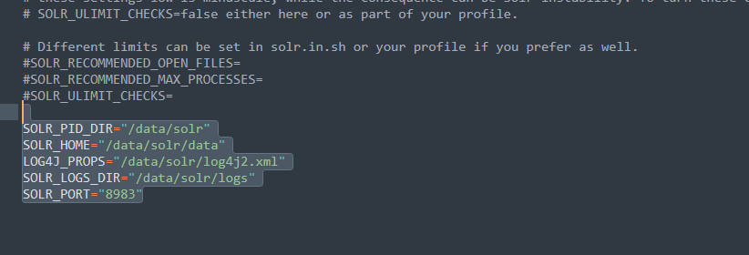
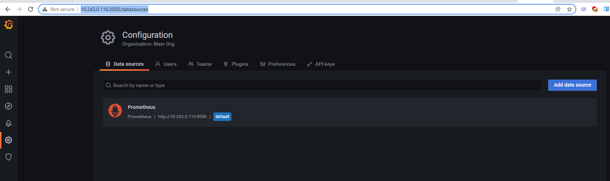
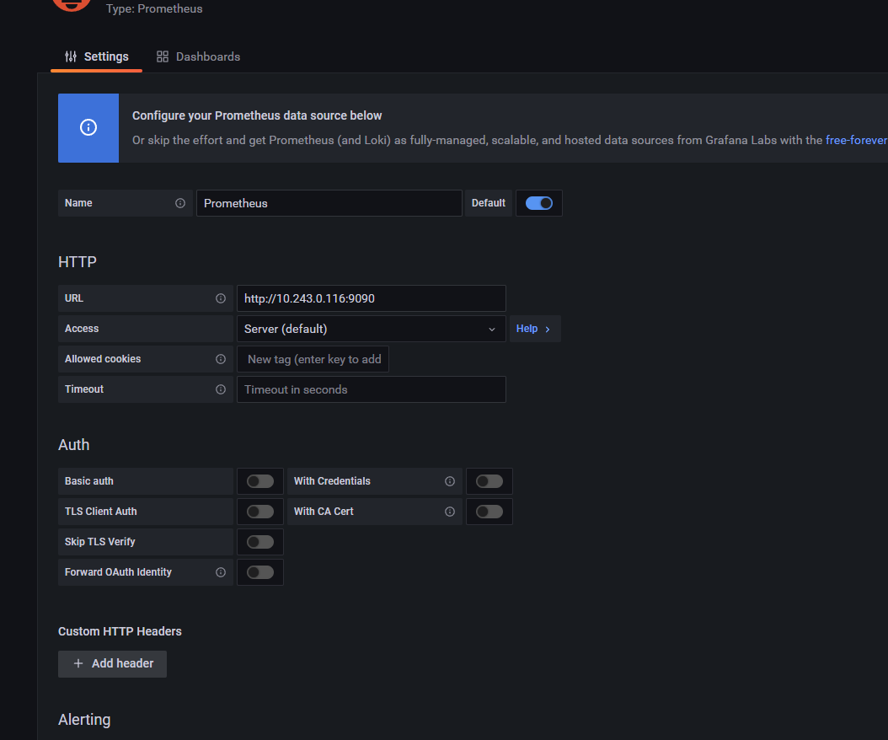
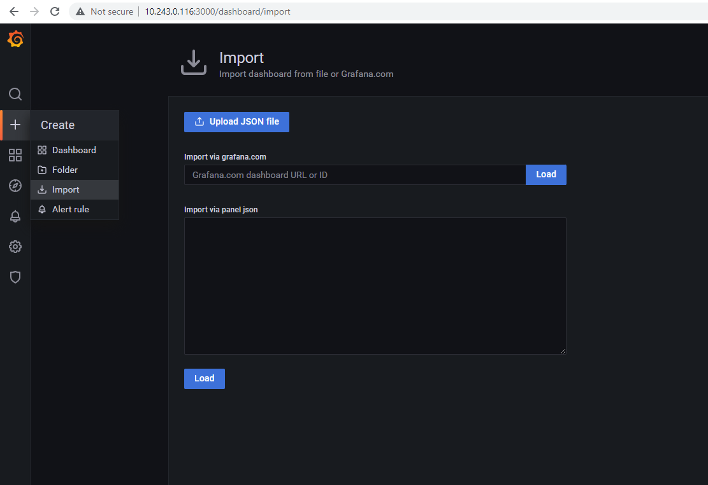

# Hướng dẫn Cài đặt SolrCloud Cluster + Solr Monitor

## Mục lục

- [1. Yêu cầu hệ thống](#1-yêu-cầu-hệ-thống)
- [2. Cài đặt Java](#2-cài-đặt-java)
- [3. Cài đặt Zookeeper Ensemble](#3-cài-đặt-zookeeper-ensemble)
- [4. Cài đặt SolrCloud](#4-cài-đặt-solrcloud)
- [5. Tối ưu hệ thống](#5-tối-ưu-hệ-thống)
- [6. Cài đặt Solr Monitor](#6-cài-đặt-solr-monitor)
- [7. Gở cài đặt Solr](#7-gở-cài-đặt-solr)

## 1. Yêu cầu hệ thống

- Ubuntu 20.04 LTS
- Tối thiểu 3 server cho Zookeeper ensemble
- Java 17
- Đủ dung lượng ổ đĩa cho data và logs
- RAM tối thiểu 32GB (khuyến nghị 64GB cho production)
- CPU: Tối thiểu 8 cores (khuyến nghị 16 cores cho production)

## 2. Cài đặt Java

```bash
# Cập nhật package list
sudo apt-get update
sudo apt-get upgrade

# Cài đặt OpenJDK 17
sudo apt-get install openjdk-17-jdk

# Kiểm tra version Java
java -version
```

## 3. Cài đặt Zookeeper Ensemble

### 3.1. Tạo user và thư mục

```bash
# Tạo user zookeeper
sudo useradd -m zookeeper
sudo usermod --shell /bin/bash zookeeper
sudo passwd zookeeper

# Thêm user vào sudo group
sudo usermod -aG sudo zookeeper

# Tạo thư mục data
sudo mkdir -p /data/zookeeper
sudo chown -R zookeeper:zookeeper /data/zookeeper
```

### 3.2. Cài đặt Zookeeper

Chú ý: Solr7 (Zookeeper 3.4.11), Solr9 (Zookeeper 3.8.1)

```bash
cd /opt
sudo wget https://dlcdn.apache.org/zookeeper/zookeeper-3.8.1/apache-zookeeper-3.8.1-bin.tar.gz
sudo tar -xvf apache-zookeeper-3.8.1-bin.tar.gz
sudo mv apache-zookeeper-3.8.1-bin zookeeper
sudo chown -R zookeeper:zookeeper /opt/zookeeper
```

### 3.3. Cấu hình Zookeeper

#### *1. Tạo file myid cho từng server*

```bash
# Trên server 1
echo "1" | sudo tee /data/zookeeper/myid

# Trên server 2
echo "2" | sudo tee /data/zookeeper/myid

# Trên server 3
echo "3" | sudo tee /data/zookeeper/myid
```

#### *2. Tạo file cấu hình zoo.cfg*

```bash
sudo nano /opt/zookeeper/conf/zoo.cfg
```

```properties
tickTime = 2000
dataDir = /data/zookeeper
clientPort = 2181
initLimit = 5
syncLimit = 2
server.1=server1:2888:3888
server.2=server2:2888:3888
server.3=server3:2888:3888
4lw.commands.whitelist=\*
```

#### *3. Tạo systemd service*

```bash
sudo nano /etc/systemd/system/zookeeper.service
```

Nội dung file zookeeper.service:

```ini
[Unit]
Description=Apache Zookeeper Server
Documentation=http://zookeeper.apache.org
Requires=network.target
After=network.target

[Service]
Type=forking
WorkingDirectory=/opt/zookeeper
User=zookeeper
Group=zookeeper
ExecStart=/opt/zookeeper/bin/zkServer.sh start /opt/zookeeper/conf/zoo.cfg ExecStop=/opt/zookeeper/bin/zkServer.sh stop /opt/zookeeper/conf/zoo.cfg ExecReload=/opt/zookeeper/bin/zkServer.sh restart /opt/zookeeper/conf/zoo.cfg
TimeoutSec=30
Restart=on-failure

[Install]
WantedBy=default.target
```

### 3.5. Khởi động và kiểm tra

#### *1. Khởi động service*

```bash
# Reload systemd daemon
sudo systemctl daemon-reload

# Khởi động Zookeeper
sudo systemctl start zookeeper

# Đặt khởi động cùng hệ thống
sudo systemctl enable zookeeper

# Kiểm tra status service
sudo systemctl status zookeeper
```

## 4. Cài đặt SolrCloud

Ví dụ có 3 server là server1, server2, server3 (có thể thay bằng các ip address). Cài đặt lần lượt trên từng server với các bước sau:

### 1. Tải Solr về máy (ví dụ đặt trong /opt)

```bash
cd /opt

wget <https://www.apache.org/dyn/closer.lua/solr/solr/9.3.0/solr-9.3.0.tgz?action=download>

# hoặc

wget <https://www.apache.org/dyn/closer.lua/solr/solr/7.6.0/solr-7.6.0.tgz?action=download>
```

Giải nén file install_solr_service.sh trong solr-9.3.0.tgz (hoặc 7.6.0) vào thư mục hiện hành.

```bash
tar xzf solr-9.3.0.tgz solr-9.3.0/bin/install_solr_service.sh --strip-components=2
```

### 2. Cài đặt service

```bash
sudo bash ./install_solr_service.sh solr-9.3.0.tgz
```

hoặc:

```bash
sudo bash ./install_solr_service.sh solr-9.3.0.tgz -i /opt -d /data/solr -u solr -s solr -p 8989
```

*Lưu ý:*

Nên dùng param -d /data/solr để lưu logs và data index của Solr, sẽ thuận tiện hơn trong việc upgrade Solr version.

Nếu /data không được mount đủ dung lượng thì có thể thay bằng path khác (dùng lệnh df -h để tìm) thì sẽ ko cần cấu hình lại.

- Kiểm tra dịch vụ

```bash
# kiểm tra trạng thái
systemctl status solr
```

### 3. Cấu hình

Dừng dịch vụ

```bash
systemctl stop solr
```

Vào file solr.in.sh trong `/etc/default/solr.in.sh`, set tham số ZK_HOST như sau:

```bash
ZK_HOST=zk_server1:port,zk_server2:port,zk_server3:port
SOLR_HOST="IP_Server"
SOLR_JAVA_MEM="-Xms20g -Xmx20g"
```

Chỉnh lại đường dẫn của lưu trữ log và data vào đường dẫn đĩa được mount (dùng lệnh df -h để tìm) vào trong file /etc/default/solr.in.sh



*CHÚ Ý:* khai báo lại ip cho từng server nếu chạy solr = ip không được

Khai báo địa chỉ ip server và tên máy

```bash
nano /etc/hosts

#vd: 10.239.1.101 vilg-solr-9
```

### 4. Update thư viện

Thay tất cả file trong `\\server\\solr-webapp\\webapp\\WEB-INF\\lib` gốc bằng file của vietbando (Solr 9: [https://git.vietbando.vn/dangtn/solr-9x.git](https://git.vietbando.vn/dangtn/solr-9x.git) . Solr 7: [https://git.vietbando.net/tndang/solr_jar.git](https://git.vietbando.net/tndang/solr_jar.git)).

### 5. UpConfig vbdtemplate

Chép config của vbdtemplate vào thư mục /opt/solr-9.3.0/server/solr/configsets/vbdtemplate (Solr 9: [https://git.vietbando.vn/dangtn/solr-9x.git](https://git.vietbando.vn/dangtn/solr-9x.git) . Solr 7 nhánh 3.0.0: [https://git.vietbando.net/tndang/solr_configs.git](https://git.vietbando.net/tndang/solr_configs.git)>).

### 6. Copy models (Chỉ dùng cho Solr 9 nếu có nhu cầu sử dụng Tiếng Việt, không thì bỏ qua)

Copy thư mục Models vào `/opt/solr-9.3.0/server` (Solr 9: [https://git.vietbando.vn/dangtn/solr-9x.git](https://git.vietbando.vn/dangtn/solr-9x.git)).

```bash
cd /opt/solr-9.3.0/server/scripts/cloud-scripts
```

Tạo file upConfig:

```bash
nano upconfig.sh

# với nội dung như sau:
./zkcli.sh -cmd upconfig -zkhost " zk_server1:port,zk_server2:port,zk_server3:port " -confname vbdtemplate -confdir /opt/solr-9.3.0/server/solr/configsets/vbdtemplate/conf
```

Cấp quyền cho các file .sh

```bash
chmod +x upconfig.sh
chmod +x zkcli.sh
```

Run : ./upconfig.sh

Restart solr service.

```bash
systemctl start solr
```

## 5. Tối ưu hệ thống

Link tham khảo config:

[https://medium.com/bliblidotcom-techblog/optimizing-solr-resources-with-g1-448bb9c49d46](https://medium.com/bliblidotcom-techblog/optimizing-solr-resources-with-g1-448bb9c49d46)

[https://www.oracle.com/technical-resources/articles/java/g1gc.html](https://www.oracle.com/technical-resources/articles/java/g1gc.html)

### 1. Install Java 17

### 2. Config Solr.config

```
ParallelGCThreads = 5/8\*(tổng số core cpu)

ConcGCThreads = 1/4\*ParallelGCThreads
```

Sample:

```bash
GC_TUNE="-XX:+UseG1GC

\-XX:+PerfDisableSharedMem

\-XX:+ParallelRefProcEnabled

\-XX:G1HeapRegionSize=16m

\-XX:MaxGCPauseMillis=250

\-XX:InitiatingHeapOccupancyPercent=75

\-XX:+UseLargePages

\-XX:+AggressiveOpts

\-XX:ConcGCThreads=10

\-XX:MaxTenuringThreshold=8

\-XX:NewRatio=3

\-XX:ParallelGCThreads=40

\-XX:PretenureSizeThreshold=64m

\-XX:SurvivorRatio=4

\-XX:TargetSurvivorRatio=90"
```

### 3. To increase the max_map_count parameter

#### *1. Add the following line to /etc/sysctl.conf*

vm.max_map_count=map_count

where map_count should be around 1 per 128 KB of system memory. For example:

vm.max_map_count=2097152

on a 256 GB system.

#### *2. Reload the config as root*

sysctl -p

## 6. Cài đặt Solr Monitor

### 6.1 Sorl Exporter

### 6.2 Cấu hình Prometheus

File `prometheus.yml`

```yaml
scrape_configs:
  - job_name: 'solr'
    static_configs:
      - targets: ['localhost:9854']
```

Sau khi cấu hình xong, start hoặc restart `prometheus`

```bash
systemctl  start prometheus
```

Chạy lệnh sau để binding dữ liệu

```bash
cd opt/solr-9.3.0/contrib/prometheus-exporter
chmod +x bin/solr-exporter
./bin/solr-exporter -p 9854 -z “zk_server1:2181,zk_server2:2181,zk_server3:2181” -f ./conf/solr-exporter-config.xml -n 16
```

### 6.3 Cấu hình trên Grafana

Vào site grafana để add datasource Prometheus



Chỉnh lại url đi tới server prometheus



Vào đường dẫn [http://GrafanaIP:3000/dashboard/import](http://GrafanaIP:3000/dashboard/import) để upload file json mô tả dashboard của solr tại đường dẫn `Solr\\contrib\\prometheus-exporter\\conf\\grafana-solr-dashboard.json`



## 7. Gở cài đặt Solr

```bash
systemctl stop solr

systemctl disable solr

rm /etc/systemd/system/solr

rm /etc/systemd/system/solr.service

rm /usr/lib/systemd/system/solr

rm /usr/lib/systemd/system/solr.service

systemctl daemon-reload

systemctl reset-failed
```
