# DATA-WAREHOUSE

## 1. Tổng quan

**Data-warehouse** là phần mềm quản lý tổng kho dữ liệu VDB. Cho phép tích hợp, chia sẻ, khai thác dữ liệu một cách nhanh chóng và hiệu quả.

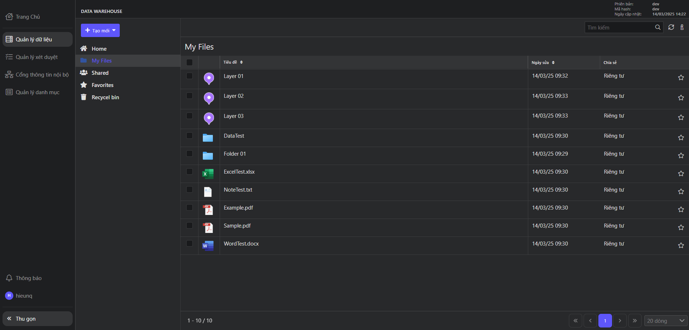

## 2. Danh mục các chức năng chính

Nhìn vào menu có thể thấy danh mục các chức năng trong dự án:

- **Trang chủ**: Cổng thông tin quản lý dự án.
- **Quản lý dữ liệu**: Nơi chứa tất cả các dữ liệu file, layer, folder của user và những dữ liệu được chia sẻ có quyền sử dụng.
- **Quản lý xét duyệt**: Nơi quản lý tất cả các yêu cầu xét duyệt về dữ liệu công khai và quyền sử dụng dữ liệu.
- **Cổng thông tin nội bộ**: Nơi tổng hợp tất cả dữ liệu đã được xét duyệt công khai và dùng để yêu cầu quyền sử dụng dữ liệu.
- **Quản lý danh mục**: Nơi quản lý danh mục phân loại dịch vụ.
- **Thông báo**: Danh sách lịch sử thông báo của user.

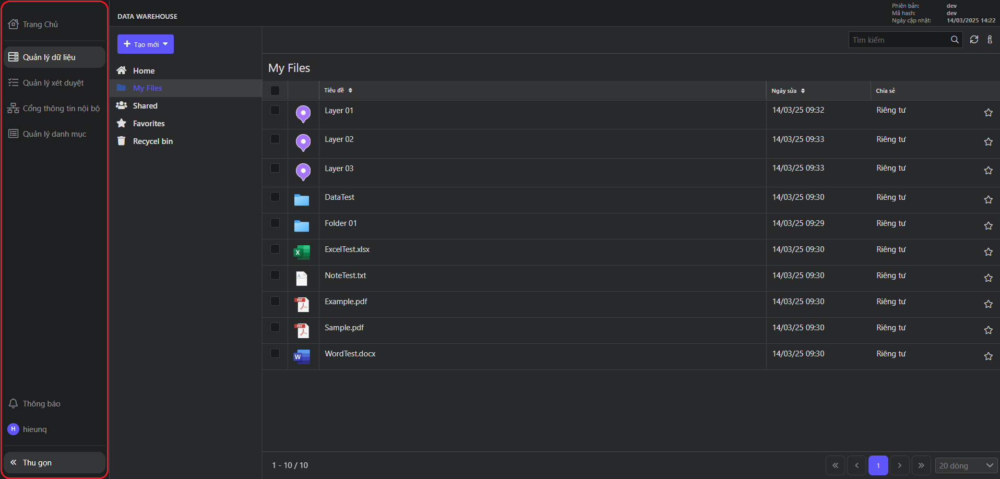

Ngoài ra còn một số tính năng trong menu.
Bấm vào tab **Thông tin cá nhân** để chỉnh sửa hệ thống.

- Bấm vào tên user để xem và cập nhật thông tin tài khoản.
- Chuyển đổi ngôn ngữ để thay đổi ngôn ngữ tiếng anh hoặc tiếng việt.
- Chủ đề để thay đổi giao diện sáng hoặc tối.
- Đăng xuất để logout ra khỏi tài khoản hiện tại.

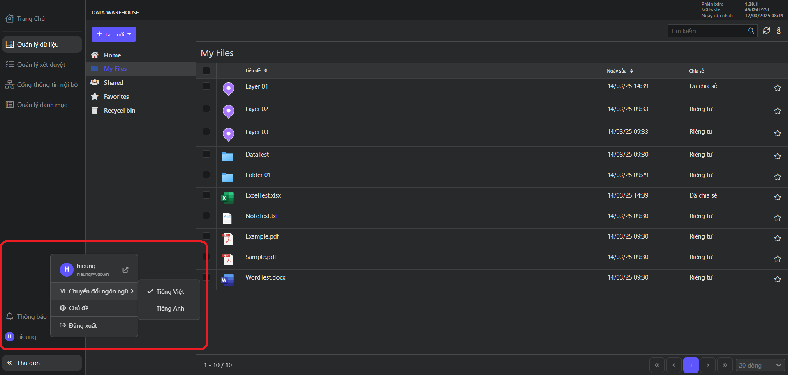

Bấm vào tab **Thu gọn** để đóng menu về dạng thu gọn.

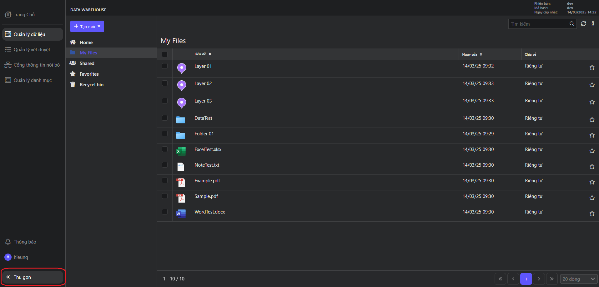

### 2.1. Quản lý dữ liệu

Trong phần quản lý dữ liệu sẽ được chia ra làm 5 mục con:

- **Home**: Chứa tất cả các dữ liệu có quyền sử dụng (dữ liệu cá nhân và được chia sẻ).
- **My Files**: Chứa tất cả các dữ liệu của cá nhân chủ tài khoản.
- **Shared**: Chứa tất cả các dữ liệu được chia sẻ mà cá nhân có quyền sử dụng.
- **Favorites**: Chứa các dữ liệu được đánh dấu yêu thích (quan trọng).
- **Recycle Bin**: Chứa các dữ liệu bị xóa.

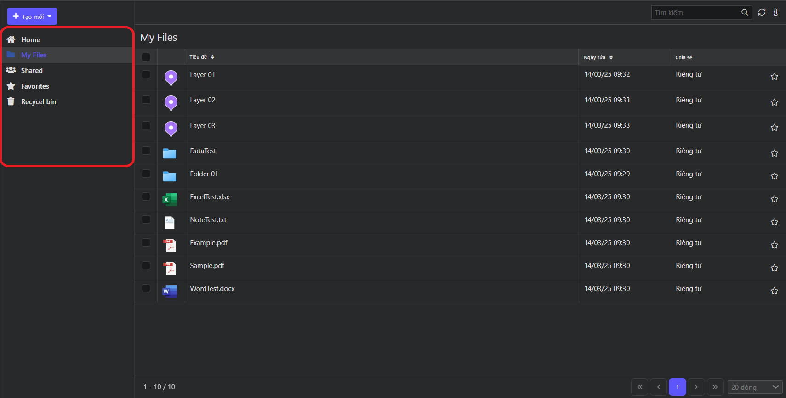

### Một số tính năng chung

Thêm mới dữ liệu bao gồm: **Tạo thư mục**, **tải file lên**, **tải thư mục lên**, **tạo lớp dữ liệu**. Dữ liệu sẽ được thêm mới tại vị trí thư mục hiện tại có quyền thêm mới hoặc sẽ được thêm vào thư mục **My Files**.

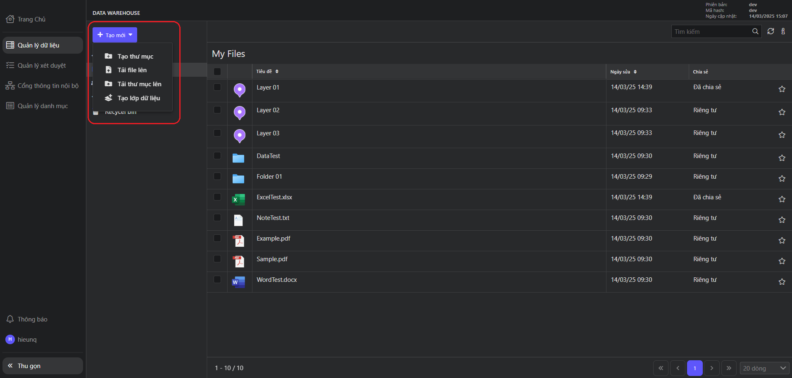

Tìm kiếm dữ liệu.

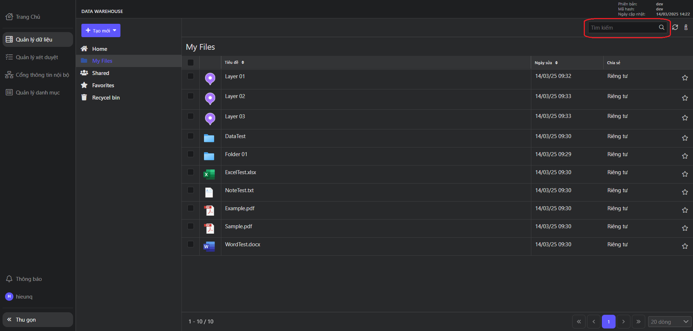

Làm mới dữ liệu.

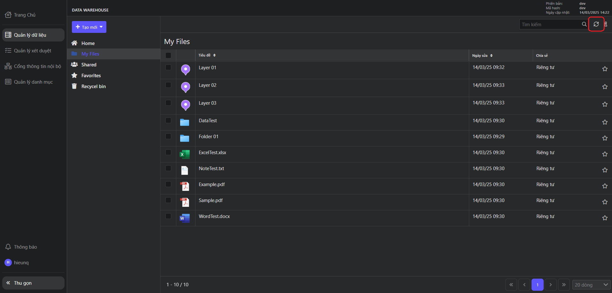

Hiển thị thông tin chi tiết của dữ liệu

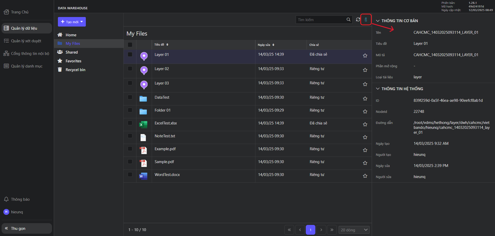

Phân trang dữ liệu

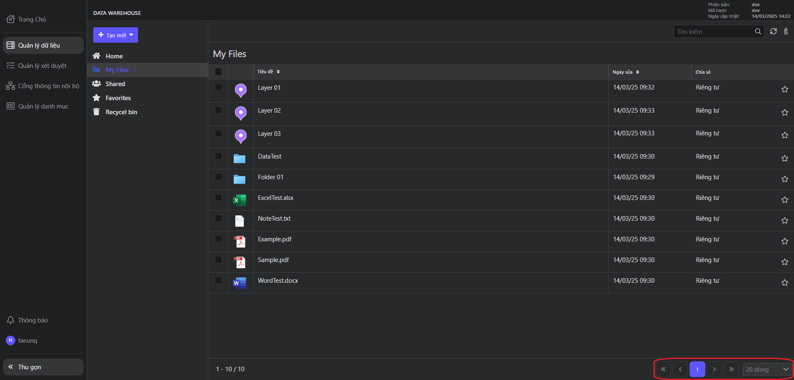

Khi hover vào item sẽ hiển thị một số thao tác nhanh như:

1.  Thêm dữ liệu vào danh sách yêu thích.
2.  Chia sẻ hoặc ngừng chia sẻ dựa vào trạng thái hiện tại của dữ liệu.
3.  Mở menu chứa nhiều thao tác hơn cho dữ liệu. Cũng có thể nhấp chuột phải vào item hoặc chọn vào item để mở ra menu hoặc các thao tác tương ứng.

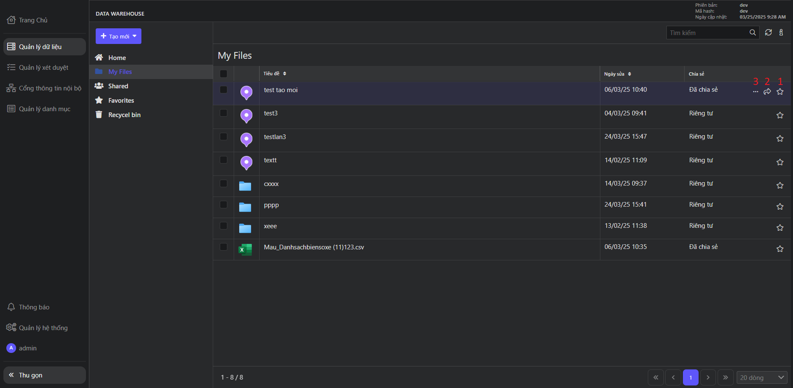

Tùy vào loại dữ liệu và quyền truy cập mà mỗi item sẽ có menu thao tác khác nhau bao gồm:

- **Nhập liệu**: Nhập dữ liệu dưới dạng excel mẫu vào trong layer.
- **Xuất dữ liệu**: Tải dữ liệu bên trong layer về dưới dạng excel.
- **Chia sẻ/Ngừng chia sẻ**: Yêu cầu chia sẻ hoặc ngừng chia sẻ dữ liệu công khai tùy vào trạng thái của dữ liệu.
- **Chia sẻ nội bộ**: Phân quyền, chia sẻ dữ liệu cho nội bộ của user.
- **Chia sẻ OGC**: Chia sẻ dữ liệu layer theo chuẩn OGC (WMS, WMTS, WFS).
- **Xóa**: Xóa dữ liệu (vào thùng rác).
- **Tải xuống**: Tải dữ liệu.
- **Yêu thích**: Thêm dữ liệu vào danh sách yêu thích.
- **Chuyển đến**: Chuyển dữ liệu đến thư mục khác.
- **Chỉnh sửa**: Đổi tên, thêm/sửa/xóa thuộc tính, chỉnh sửa kiểu dáng, comment đối với dữ liệu layer.
- **Đổi tên**: Thay đổi tên dữ liệu.
- **Sao chép**: Sao chép dữ liệu đến thư mục khác.
- **Lịch sử thay đổi**: Xem lịch sử thay đổi của dữ liệu.
- **Lịch sử xét duyệt**: Xem lịch sử xét duyệt của dữ liệu.

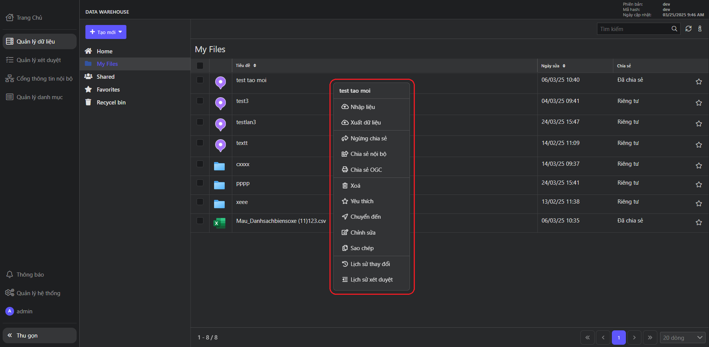

Để xem chi tiết nội dung bên trong dữ liệu thì click đúp vào dữ liệu. Tùy vào loại dữ liệu sẽ có chế độ hiển thị khác nhau.

### 2.2. Quản lý xét duyệt

Trong phần quản lý xét duyệt được chia làm 3 tab con:

- **Công khai**: Chứa dữ liệu công khai mà tài khoản có quyền xét duyệt.
- **Đăng ký công khai**: Chứa dữ liệu đang được yêu cầu xét duyệt công khai.
- **Đăng ký sử dụng**: Chứa dữ liệu đang được yêu cầu sử dụng.

Ở tab **Công khai** có 2 chức năng chính là **Ngừng công khai** hoặc **Ngừng cấp quyền** của tất cả user, group đang đăng ký sử dụng. Ngoài ra, còn có thể xem, sửa, xóa quyền của từng user, group khi bấm vào từng tag ở cột "Cá nhân, tổ chức đăng ký".

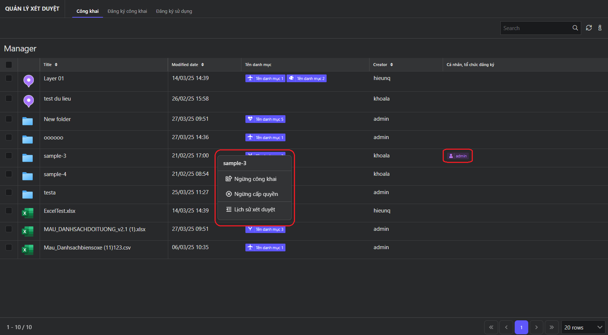

Tab **Đăng ký công khai** có chức năng xét duyệt **Công khai** hoặc **Từ chối dữ liệu**. Nếu dữ liệu được công khai sẽ đẩy qua tab **Công khai**.

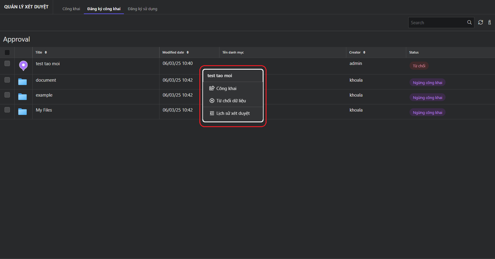

Tab **Đăng ký sử dụng** có chức năng xét duyệt quyền sử dụng dữ liệu của user, group. Có thể **Đồng ý tất cả đăng ký** hoặc **Từ chối tất cả đăng ký** sử dụng cùng một lúc. Hoặc chọn từng "Cá nhân, tổ chức đăng ký" để xét duyệt đồng ý hay từ chối.

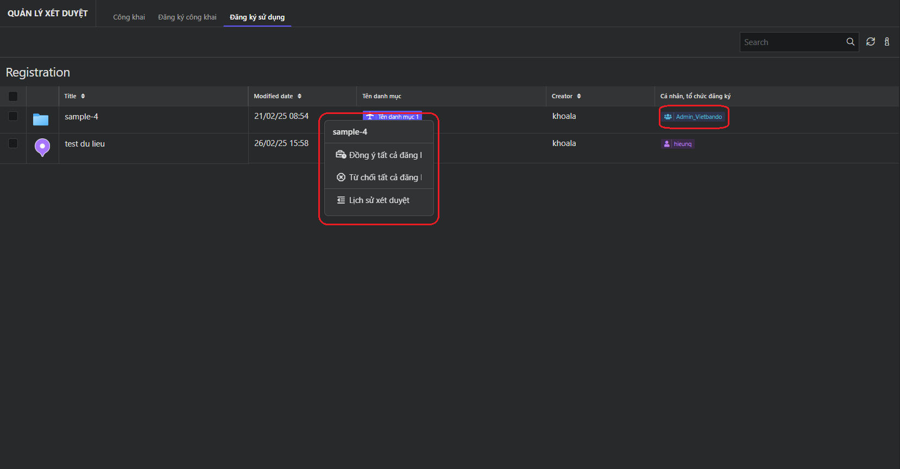

### 2.3. Cổng thông tin nội bộ

Nơi dùng để xin quyền sử dụng dữ liệu công khai. Có thể đăng ký sử dụng dữ liệu cho cá nhân hoặc tổ chức với toàn quyền hoặc một số quyền giới hạn. Để chỉnh sửa hoặc xóa quyền đã yêu cầu có thể nhấp vào tag trong cột "Cá nhân, tổ chức đăng ký".

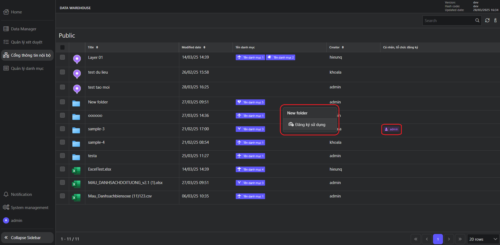

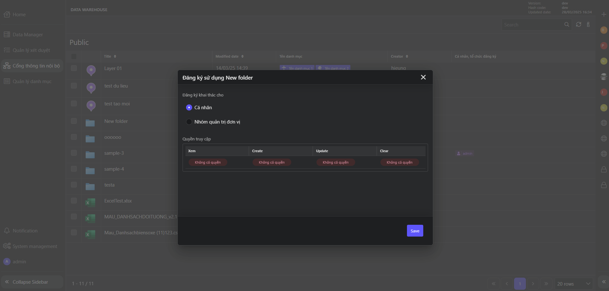

### 2.4. Quản lý danh mục

Chức năng quản lý danh sách danh mục (thêm, sửa, xóa).

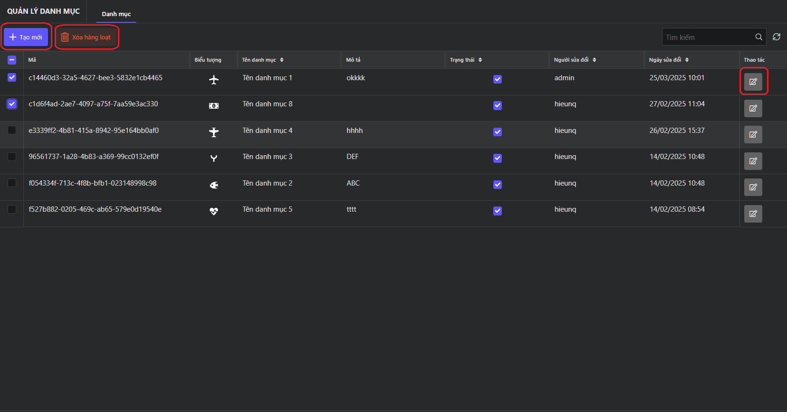

Popup chỉnh sửa (thêm tương tự)

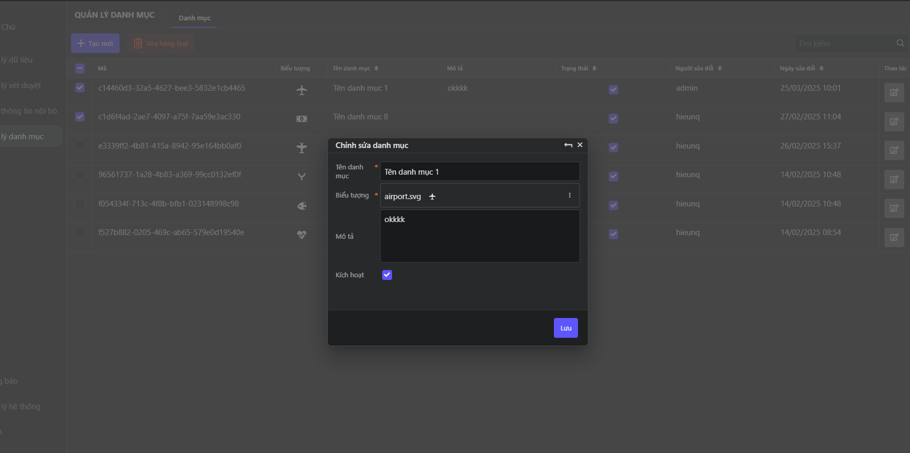

### 2.5. Thông báo

Hiển thị danh sách thông báo. Có thể filter theo trạng thái hoạt động, thời gian hoặc tìm kiếm theo nội dung thông báo.

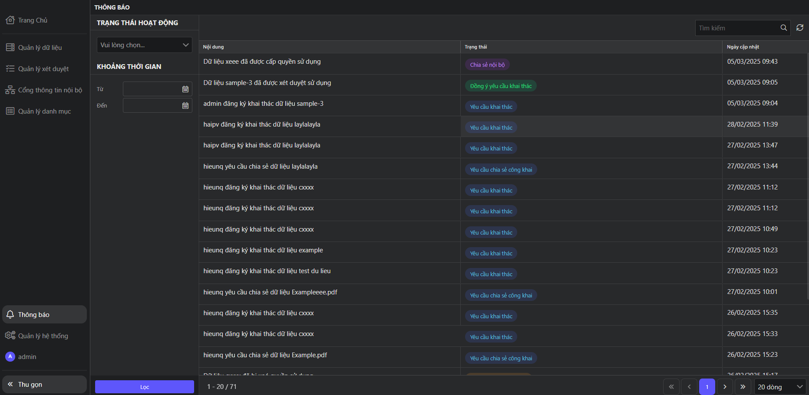
