# HDSD KHAI THÁC BẢN ĐỒ

## **1. Quản lý tài khoản**

### **1.1 Thông tin đăng nhập**

1. Truy cập trang [https://c4i2.vbd.vn](https://c4i2.vbd.vn) TRUNG TÂM ĐIỀU HÀNH THÔNG MINH

2. Nhập thông tin **Tên đăng nhập** và **Mật khẩu**

3. Chọn **Đăng nhập**

**Lưu ý:**
- Đăng nhập đúng tài khoản được cấp
- Đăng nhập sai 5 lần tài khoản sẽ bị khóa

### **1.2. Thông tin đăng xuất**

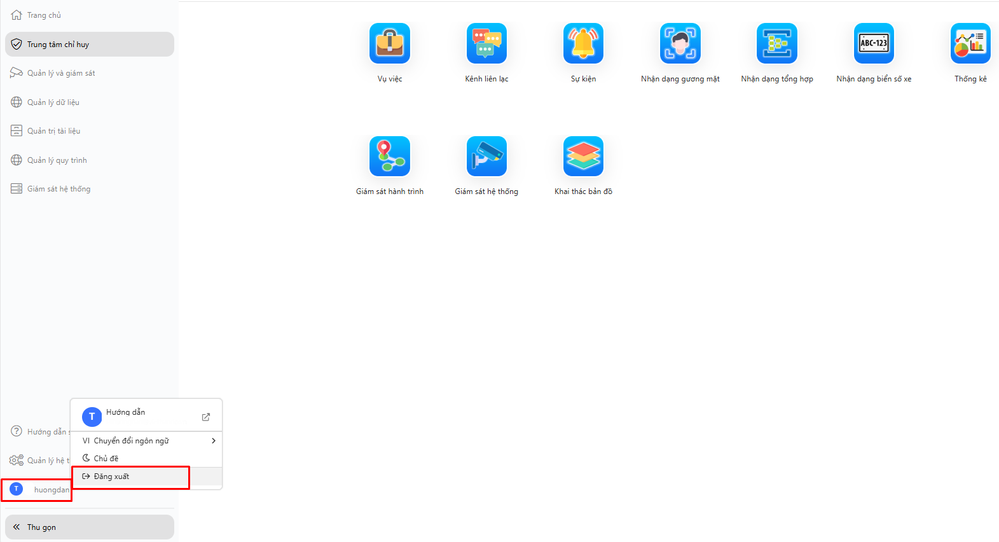

1. Chọn Thông tin cá nhân ở góc trái màn hình

2. Chọn **Đăng xuất**

### **1.3 Thay đổi mật khẩu**

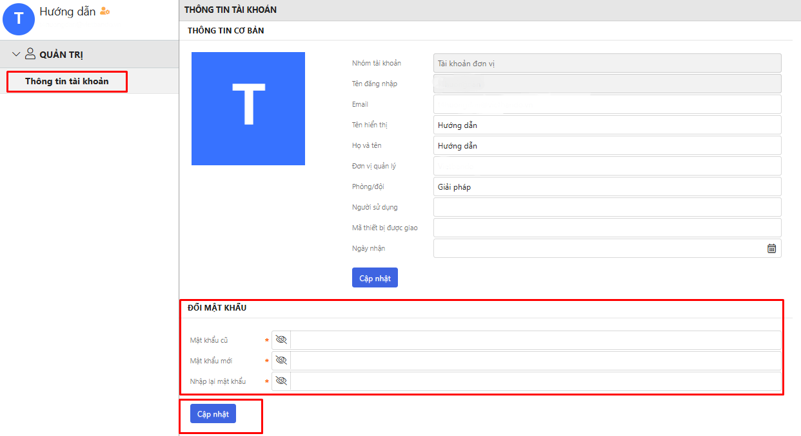

1. Chọn Thông tin tài khoản ở góc trái màn hình

2. Chọn Tài khoản -> Thông tin tài khoản

3. Nhập thông tin **Mật khẩu cũ/Mật khẩu mới**

4. Bấm **Cập nhật**

## **2. Danh mục các chức năng khai thác bản đồ**

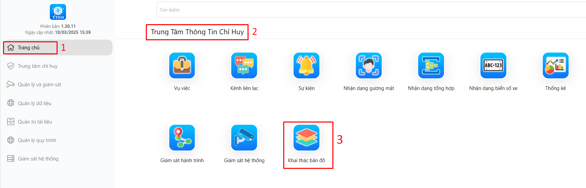

- Tại màn hình chính chọn mục **Trang chủ**

- Chọn **Trung Tâm Thông Tin Chỉ Huy**

- Chọn **Khai thác bản đồ**

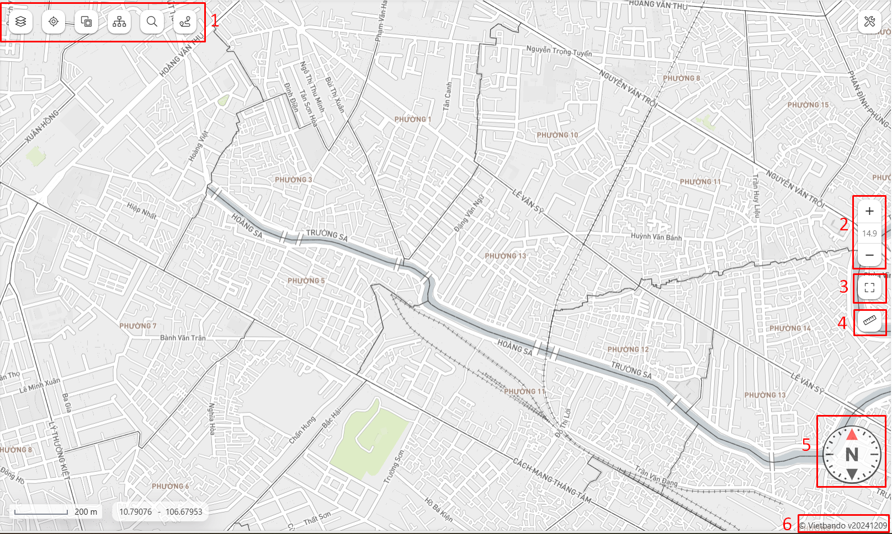

*Ghi chú:*

1: các tính năng của phân hệ Khai thác bản đồ

2: xem bản đồ ở chế độ phóng to/thu nhỏ màn hình (có thể sử dụng lăn con chuột)

3: xem chế độ toàn màn hình

4: đo khoảng cách giữa các điểm chọn trên bản đồ

5: la bàn (giữ chuột trái di chuyển màn hình, giữ chuột phải xoay màn hình 360độ)

6: phiên bản của hệ thống

### **2.1 Tài nguyên và tính năng**

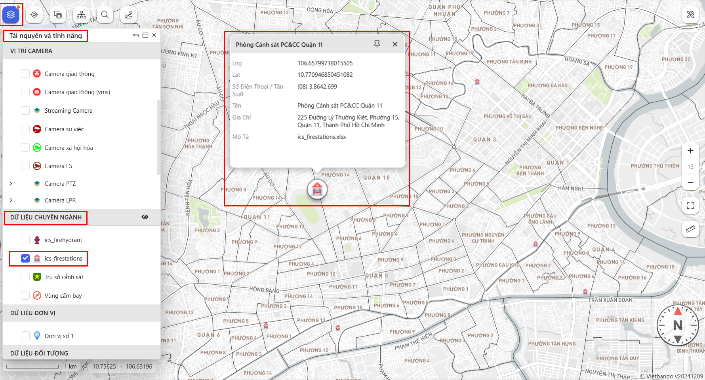

1. Chọn **Tài nguyên và tính năng**

2. Chọn **Nhóm dữ liệu**

3. Bật/Tắt **Lớp dữ liệu thành phần**

### **2.2 Giám sát hành trình**

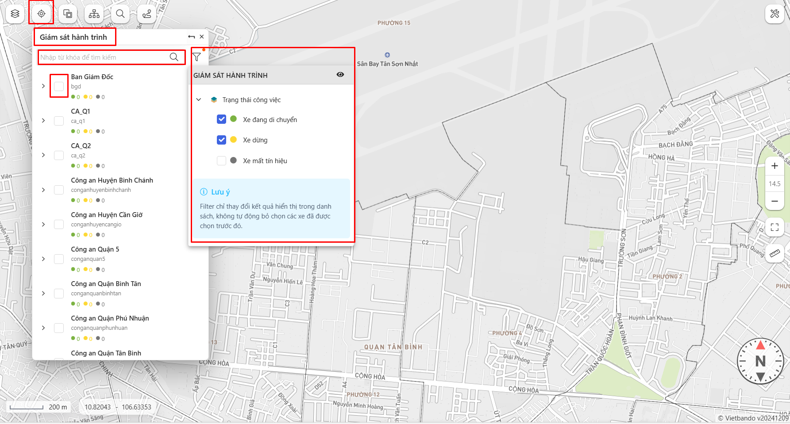

1. Chọn **Giám sát hành trình** (Giám sát hình trình của thiết bị/phương tiện xem đang ở đâu/khu vực nào?)

2. Tìm kiếm giám sát theo:

+ Nhập từ khóa để tìm kiếm (nhập thông tin của thiết bị/phương tiện)

+ Filter theo Trạng thái công việc

+ Tích chọn vào thông tin đơn vị cần giám sát

3. Tại màn hình **Giám sát hành trình** chọn 1 thiết bị/phương tiện cần giám sát hành trình

3.1 Chọn **Theo dõi** (bản đồ sẽ hiển thị khu vực thiết bị/phương tiện tại vị trí đang đứng và đi theo khi di chuyển)

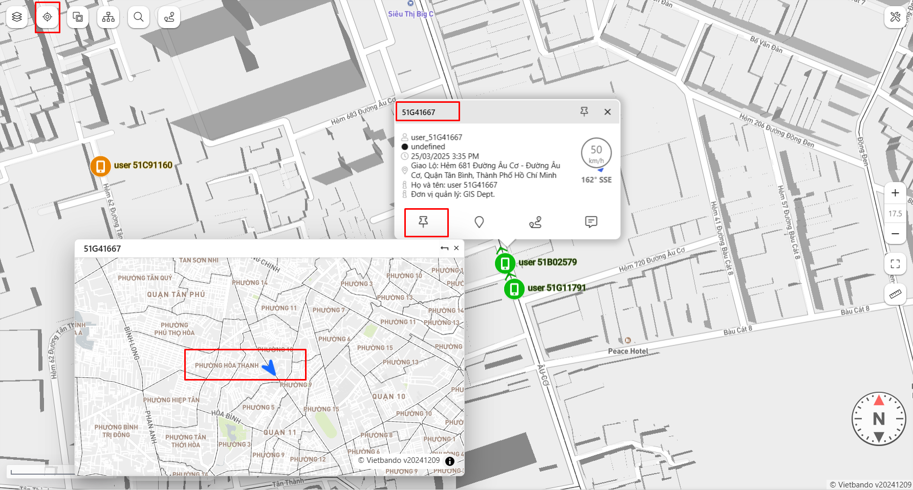

3.2 Chọn **Di chuyển đến vị trí thiết bị** (trỏ tới vị trí chính xác của thiết bị/phương tiện)

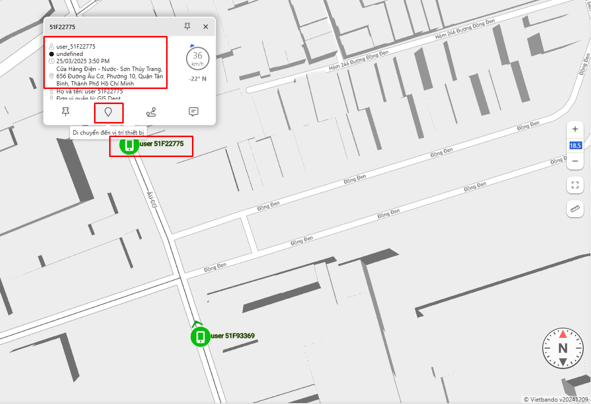

3.3 Chọn **Xem lịch sử theo dõi**

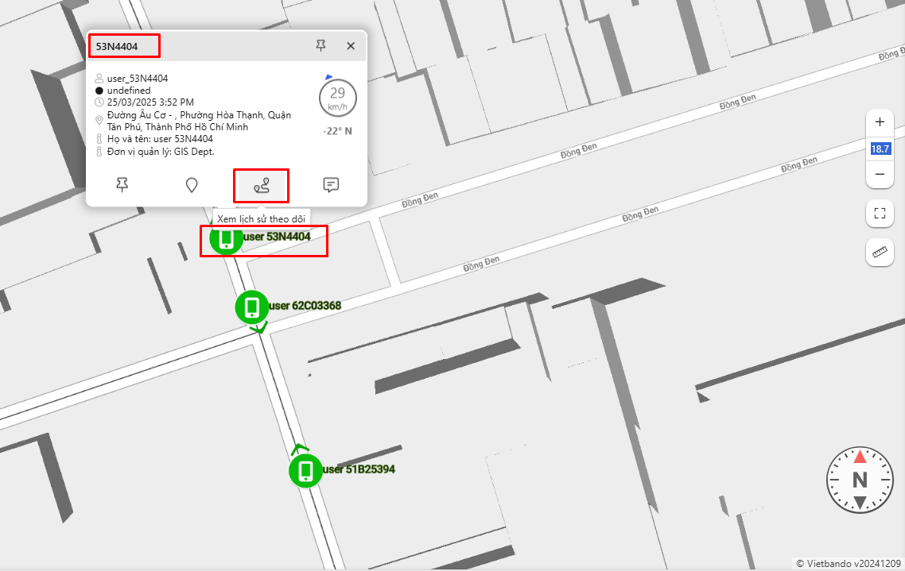

**Kết quả hiển thị lịch sử của thiết bị/phương tiện đã chọn**

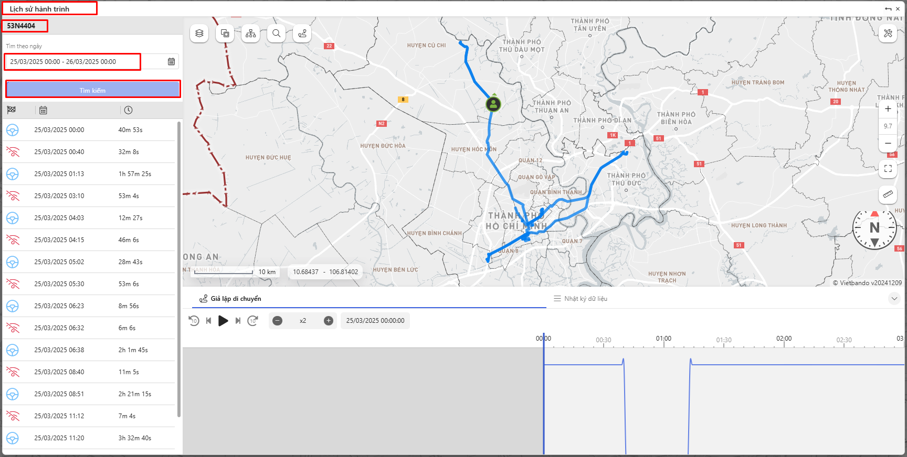

3.4 Chọn **Tin nhắn** (trao đổi thông tin qua tin nhắn với thiết bị/phương tiện đang giám sát)

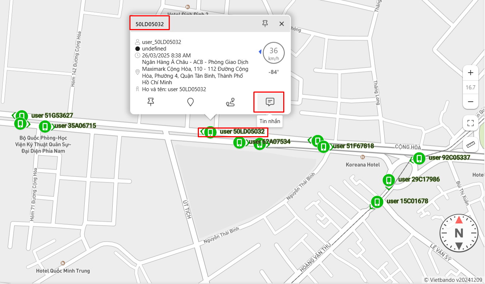

### **2.3 Loại bản đồ**

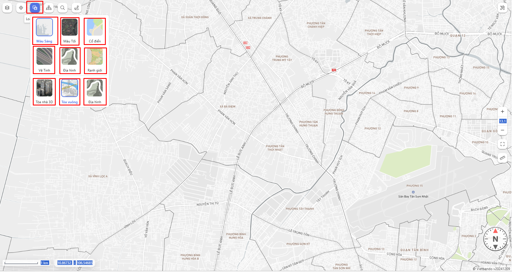

Tại màn hình chính của chức năng "Khai thác bản đồ"

1. Chọn **Loại bản đồ** (Xem bản đồ theo nhiều chế độ khác nhau)

2. Lựa chọn theo:

+ Màu Sáng

+ Màu Tối

+ Cổ Điển

+ Vệ Tinh

+ Địa hình

+ Ranh giới

+ Tòa nhà 3D

+ Tòa vuông

+ Địa hình

### **2.4 Ranh giới hành chính**

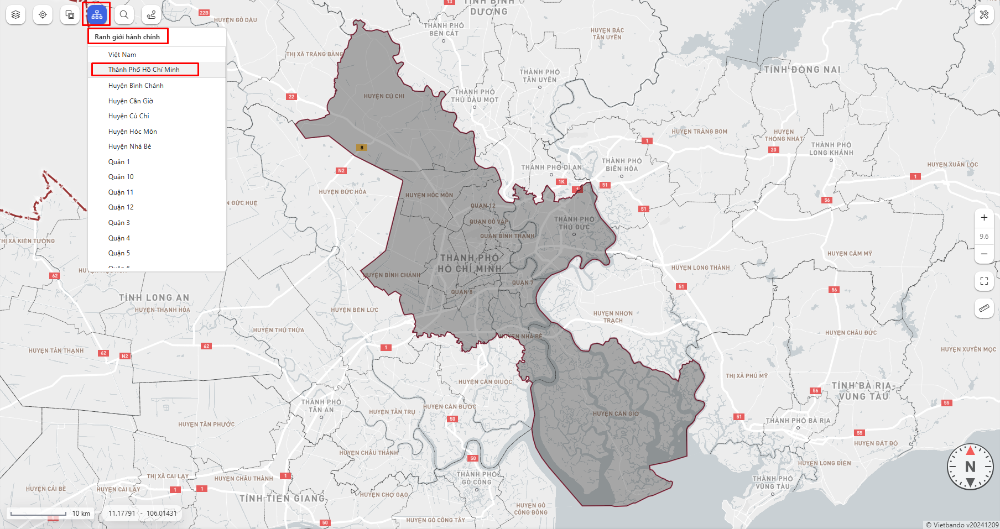

Tại màn hình chính của chức năng "Khai thác bản đồ"

1. Chọn **Ranh giới hành chính**

2. Chọn khu vực/đơn vị cần xem (xem dữ liệu theo ranh giới hành chính)

### **2.5 Tìm vị trí**

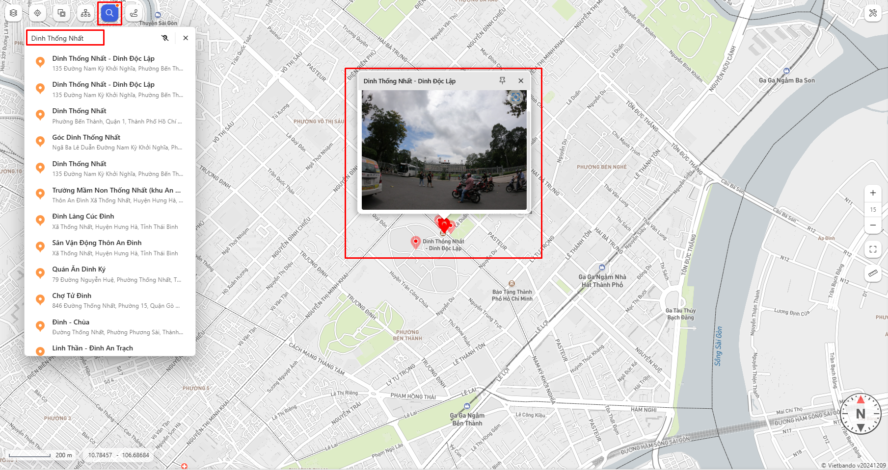

Tại màn hình chính của chức năng "Khai thác bản đồ"

1. Chọn **Tìm vị trí**

2. Nhập thông tin vị trí cần tìm

3. Kết quả (bản đồ sẽ trỏ tới vị trí đã nhập tìm)

### **2.6 Tìm đường**
- **Tại vị trí bất kì trên bản đồ**, chọn 1 vị trí và bấm chuột phải lựa chọn:

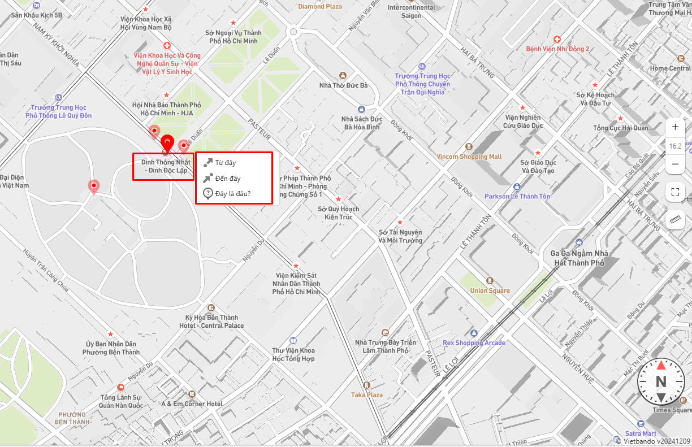

1. Chọn **Từ đây**

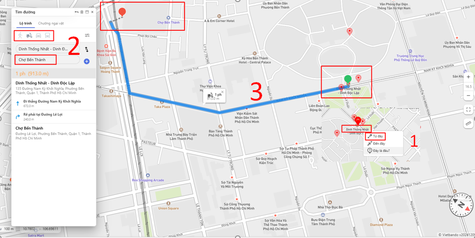

  1: Chọn 1 vị trí bất kì trên bản đồ -> bấm chuột phải -> chọn **Từ đây**

  2: Chọn Phương tiện/Điểm đến

  3: Kết quả (bản đồ hiển thị quãng đường từ điểm xuất phát đã chọn)

2. Chọn **Đến đây**

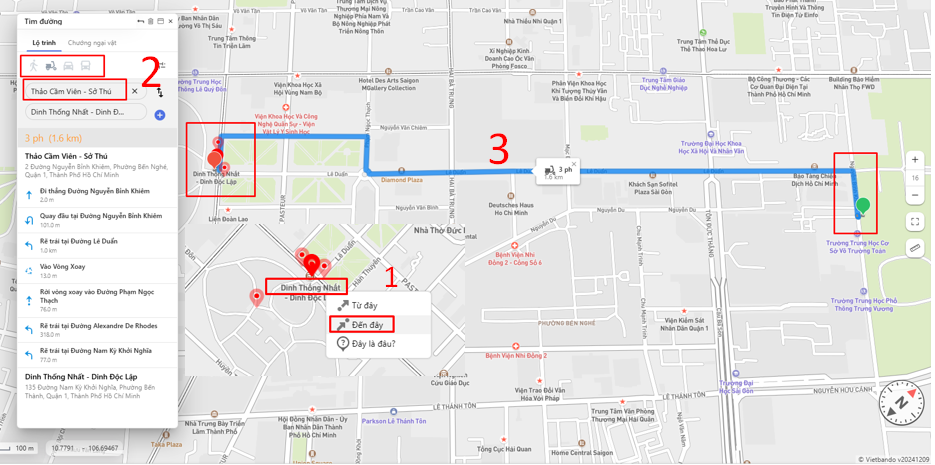

  1: Chọn 1 vị trí bất kì trên bản đồ -> bấm chuột phải -> chọn **Đến đây**

  2: Chọn Phương tiện/Điểm xuất phát

  3: Kết quả (bản đồ hiển thị quãng đường từ điểm đến đã chọn)

3. Chọn **Đây là đâu?**

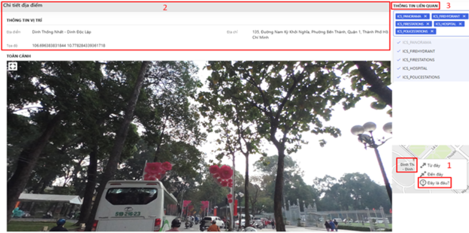

  1: Chọn 1 vị trí bất kì trên bản đồ -> bấm chuột phải -> chọn **Đây là đâu?**

  2: Kết quả chi tiết địa điểm đã chọn

  3: Thông tin các địa điểm liên quan

- **Tìm đường theo Lộ trình và Chướng ngại vật**

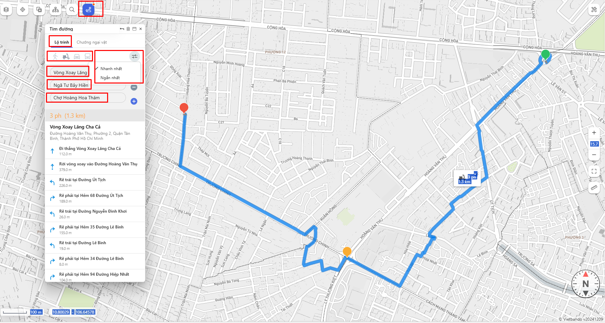

1: Tại màn hình chức năng Khai thác bản đồ, chọn tìm đường theo "Lộ trình"

2: Chọn phương pháp "Nhanh nhất" hoặc "Ngắn nhất"

3: Chọn phương tiện cần di chuyển

4: Chọn điểm xuất phát

5: Chọn điểm đến

6: Chọn điểm đi qua (nếu có)

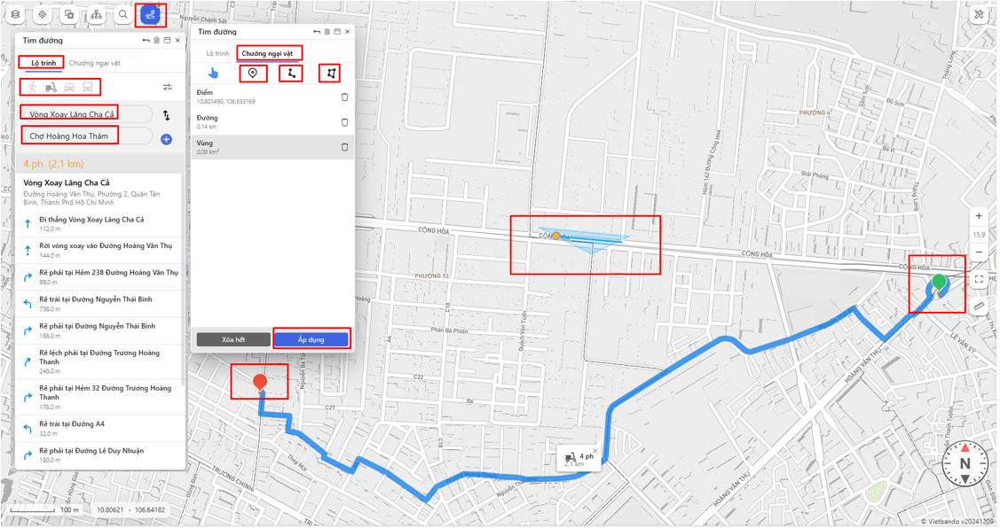

7: Chọn **Chướng ngại vật** (Hệ thống sẽ chỉ dẫn đi qua những đoạn đường không có chướng ngại vật)

8: Di chuyển con chuột chọn vào điểm/đường/vùng có chướng ngại vật

9: Bấm **Áp dụng**

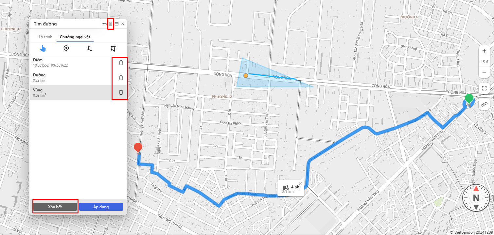

Khi muốn thay đổi tìm đường hoặc không tìm theo điều kiện nữa, bấm chọn thùng rác để xóa hoặc chọn "Xóa hết"
