# HDSD_Thống kê

## Quản lý tài khoản

### Đăng nhập

Người dùng đăng nhập vào tên đăng nhâp, mật khẩu được cấp, chọn Đăng
nhập. Sau đó người dùng nên đổi lại mật khẩu mới để đảm bảo bảo mật.

***Lưu ý:***

- Đăng nhập sai 5 lần thì tài khoản sẽ bị khóa
- Đăng nhập đúng tài khoản được cấp

### Đăng xuất

Tại góc trái, phía dưới màn hình, chọn **Thông tin cá nhân**, chọn **Đăng xuất**.

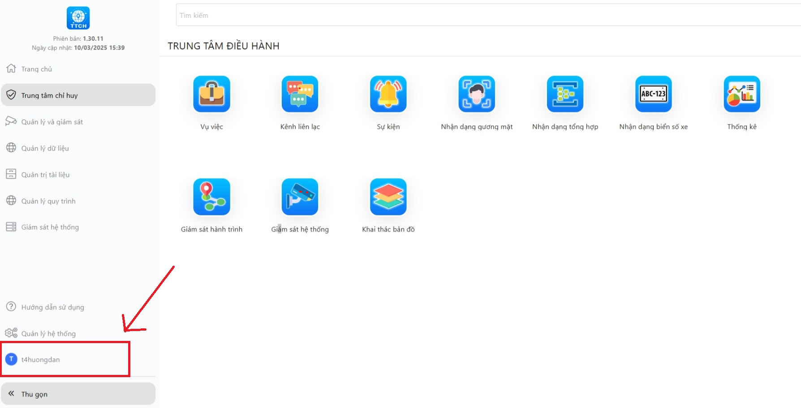

## Thống kê

### Tìm kiếm

Tại trang chủ, chọn vào mục Thống Kê

### Chức năng

Chức năng Thống kê Tổng quát hỗ trợ người dùng xem tổng quan về các mục sau: Vụ việc, Nhận dạng gương mặt, Nhận dạng biển số xe, Thiết bị, Camera. Thông tin được thể hiện chi tiết cho từng mục.

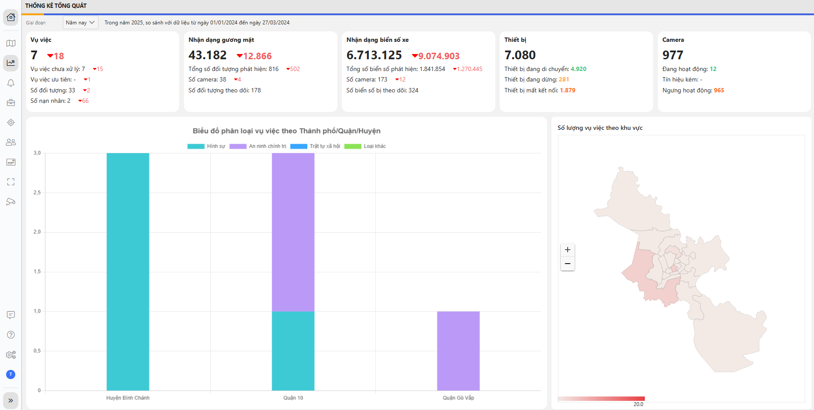

### Giai đoạn

Hệ thống cho phép người dùng xem số liệu thống kê theo khoảng thời gian mong muốn. Người dùng có thể dùng 2 cách sau:

**\*Cách 1:**

1. Tại mục Giai đoạn, click vào nút mũi tên hướng xuống, chọn thời gian cần xem số liệu thống kê đã được thiết lập sẵn như: Hôm nay, Tuần này, Tháng này, Năm này, Tùy chỉnh.

> 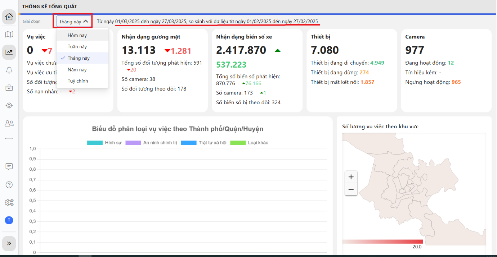

<!-- -->

2. Kế tiếp chọn thời gian người dùng cần xem -\> sau đó nhấn vào nút "**Thay đổi**"

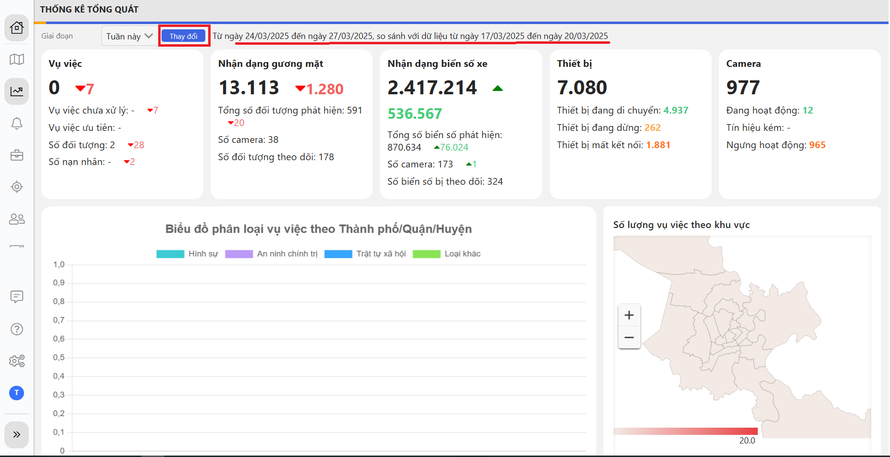

<!-- -->

3. Kết quả hiển thị như sau:

> 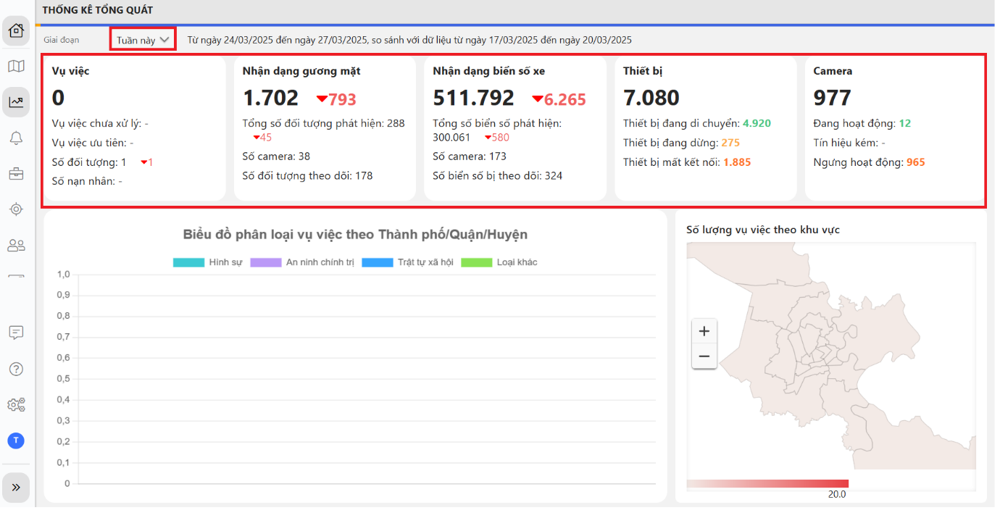

### Tùy chỉnh

Chức năng này cho phép người dùng lọc và xem dữ liệu theo một khoảng thời gian cụ thể:

**Bước 1:** Trên giao diện chính, ở chức năng "**Giai đoạn**" chọn "**Tùy chỉnh**"

**Bước 2:** Chọn khoảng ngày, click vào biểu tưởng 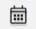 để chọn thời gian bắt đầu và thời gian kết thúc

**Bước 3:** Ở giao diện này, Hệ thống hiển thị ngày và giờ. Người dùng có thể chọn khoảng thời gian chính xác.

\+ Chọn ngày:

- Nhấn vào tab "Ngày" để mở giao diện cài đặt ngày

- Nhấp vào biểu tượng **"\>"** để chuyển sang tháng kế tiếp hoặc **"\<"** để quay lại tháng trước. Tương tự, sử dụng **"\>\>"** để chuyển sang năm kế tiếp hoặc **"\<\<"** để quay lại năm trước.

- Chọn vào ngày cần tìm kiếm

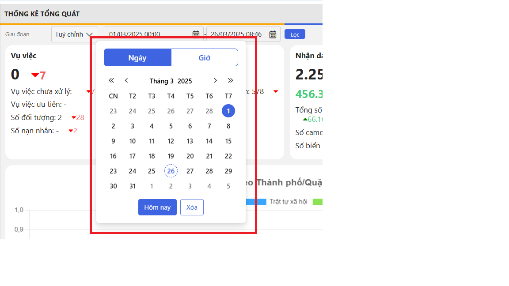

***Lưu ý**:* Nếu người dùng muốn đặt lại thời gian về mặc định, có thể nhấn nút **"Xóa"**. Tương tự, nút **"Hôm nay"** giúp nhanh chóng đặt thời gian về ngày hiện tại mà không cần thao tác phức tạp.

**+** Chọn giờ:

- Nhấn vào tab **"Giờ".**

- Sử dụng thanh trượt **"Giờ"** hoặc **"Phút"** để chọn thời gian tìm kiếm chính xác.

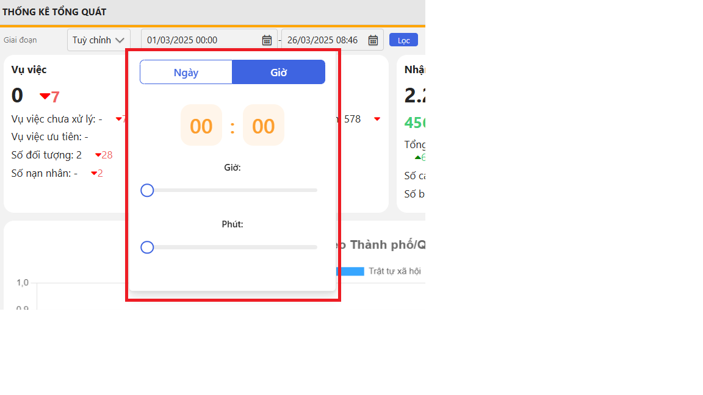

\+ Sau đó di chuyển chuột ra ngoài thanh chọn thời gian, nhấp chuột phải ra ngoài, thời gian bạn chọn sẽ thiết lập như hình minh họa dưới đây:

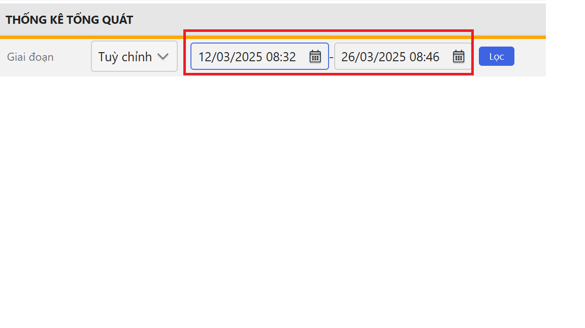

**Bước 4:** Sau khi chọn khoảng thời gian mong muốn, nhấn **"Lọc"**

**\*Cách 2:**

Nhấp con chuột vào khung thời gian, nhập ngày và giờ cần xem lần lượt vào ô thứ nhất và ô thứ 2 như hình bên dưới -\> sau đó nhấn **"Lọc"**

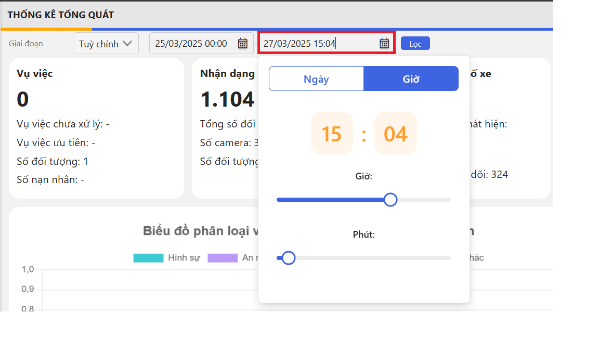

### Số lượng vụ việc trong khu vực

Người dùng có thể di chuyển con trỏ chuột trên bản đồ để hiển thị số lượng vụ việc tại từng khu vực.

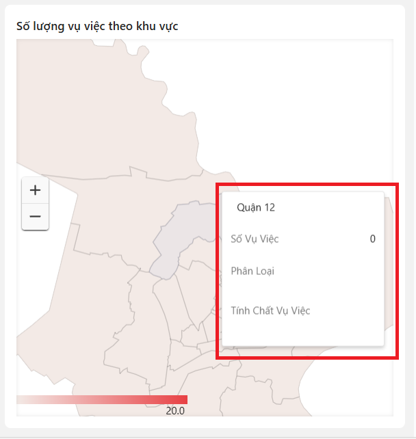

### Phóng to/nhỏ bản đồ

Để xem chi tiết từng khu vực trong Thành phố Hồ Chí Minh, người dùng có thể nhấn nút (+) để phóng to hoặc nút (-) để thu nhỏ bản đồ, như hìnhminh họa dưới đây:

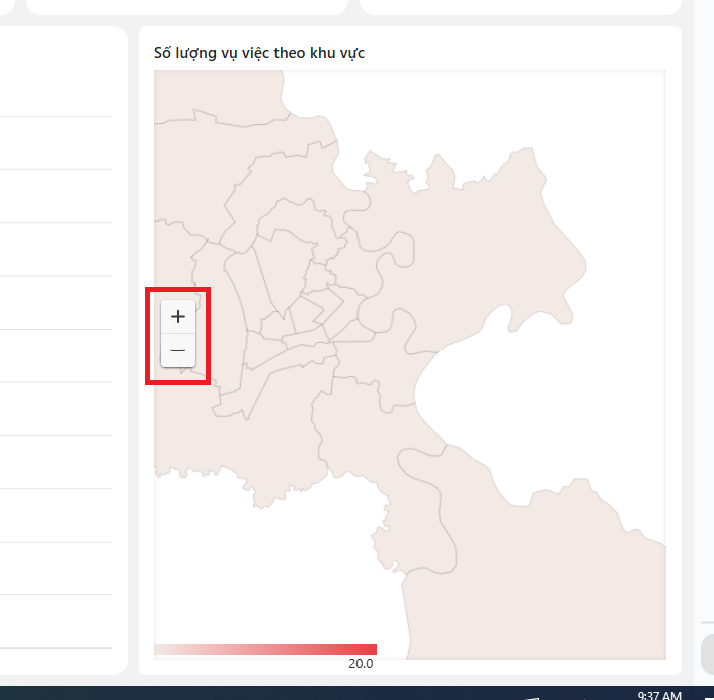