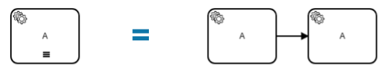
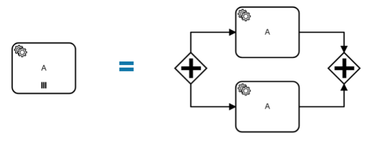
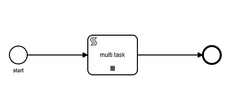
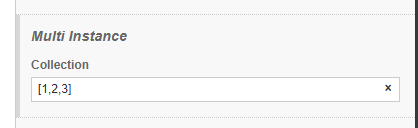
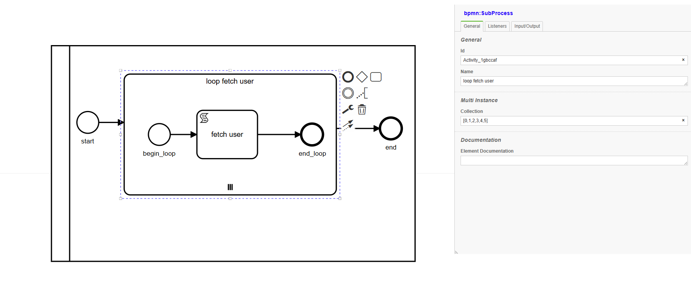

# Multi Instance

1 activity có thể có nhiều phiên bản hoạt động. Hiện tại VietBanDo Workflow Engine đang hỗ trợ tuần tự và mặc định 

# Sequence 
- Trong trường hợp hoạt động nhiều phiên bản tuần tự, các phiên bản được thực hiện từng phiên bản một. Khi một phiên bản hoàn thành, một phiên bản mới được tạo cho phần tử tiếp theo trong inputCollection


    

# Parallel 
- Trong trường hợp hoạt động đa phiên bản song song, tất cả các phiên bản đều được tạo khi nội dung đa phiên bản được kích hoạt. Các instance được thực thi đồng thời và độc lập với nhau.


    

# Example
- 1 ví dụ với Multi Insntance sequence mode
    

    
- Nhập collection cho activity **multi task** là : [0,1,2]

    
- Add script cho activity **multi task**
```js title= "multi task"
console.log(activity.name + ' ' + activity.getInputCollection()); //console input collections  
```
- Console sequence mode 
```console
multi task 1
multi task 2
multi task 3
```
- Console pararell mode 
```console
multi task 2
multi task 1
multi task 3
```
# Multi process 


    

- Khi sử dụng multi instance cho process thì mỗi activiy trong process sẽ được tạo ra. 
- ví dụ multi task cho process **loop fetch user** collection = [0,1,2,3,4,5]
- begin_loop start listener script 
```js title = "subprocess multitask"
let p = activity.getProcess(); // get process của begin_loop activity
let collection = p.getInputCollection(); // get input collection cua process
activity.setOutput(collection); 
```
-fetch user script 
```js title = "fetch user"
let num = activity.getInput(); //get number num 
let url = 'https://randomuser.me/api/?results=$number'; 
url =  url.replace("$number", num );
console.log('fetch user index: ' + num); 
console.log(url); 
const requestOptions = {
    method: 'GET', 
    headers: {
        'Content-Type': 'application/json',
    }
};
engine.fetch(url,requestOptions)
.then(result => {
  console.log('get success'); 
}).
catch(error => {
    console.error('fetch error'); 
}); 
```
- output khi chạy sequence
```console
fetch user index: 0
https://randomuser.me/api/?results=0
get success
fetch user index: 1
https://randomuser.me/api/?results=1
get success
fetch user index: 2
https://randomuser.me/api/?results=2
get success
fetch user index: 3
https://randomuser.me/api/?results=3
get success
fetch user index: 4
https://randomuser.me/api/?results=4
get success
fetch user index: 5
https://randomuser.me/api/?results=5
get success
[       OK ] test.multi_instance (3905 ms)
[----------] 2 tests from test (3906 ms total)
```
- output khi chạy Parallel
```console
fetch user index: 1
https://randomuser.me/api/?results=1
fetch user index: 2
https://randomuser.me/api/?results=2
fetch user index: 4
https://randomuser.me/api/?results=4
fetch user index: 5
https://randomuser.me/api/?results=5
fetch user index: 0
https://randomuser.me/api/?results=0
fetch user index: 3
https://randomuser.me/api/?results=3
get success
fetch error
fetch error
get success
get success
get success
[       OK ] test.multi_instance (803 ms)
```
- Tốc độ của parallel nhanh hơn 