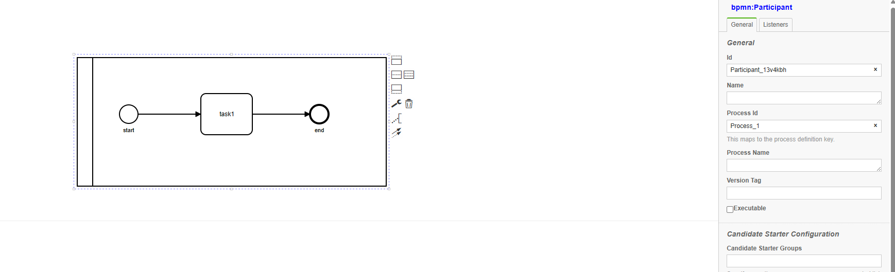
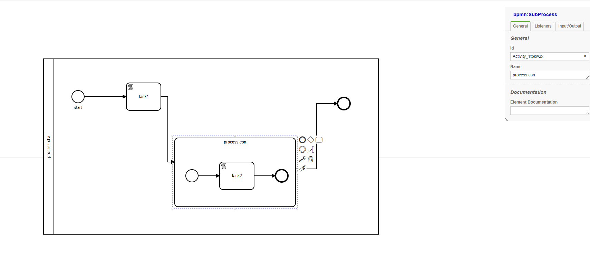
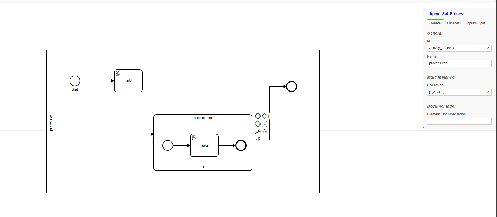

# VBD WF Engine Process 
Do các subprocess có thể chạy multi instance (parallel) nên mọi activity sẽ được chỉ định trong 1 process 
# 1 process  
 
 3 Activity start,task1,end sẽ nằm trong process với id là Process_1. Nên muốn lấy được input, out put của 3 activity này thì thông số truyền vào phải có processid. 
 Ví dụ lấy input,output của activity task1.
 ```js 
	engine.getInputCollection({
        processid : "processid", // id của processid 
        activityid : "Activity_1qdne5c", //id của activity
	}); 
 ```
# Multi process 
 
task 2 nắm trong process : process con (sub process)
để lấy input,output của activity task2 
```js
	engine.getInput({
		processid :'Activity_1tpkw2x', // id của process con
		activityid : 'Activity_0dde32d' // id của activity task 2
	});
```
# Multi instance process 
 
 process con sẽ tạo ra 5 instance chạy parallel cho nên process con sẽ có 5 id process khác nhau. Khi ta run wf ta với script trong task 2
 ```js
	let p = activity.getProcess(); //get process cha dang chua activity task 2
	console.log(p.id); //console.log id cua process do 
 ```
 ```cmd
Process_1::Activity_1tpkw2x::index::0
Process_1::Activity_1tpkw2x::index::1
Process_1::Activity_1tpkw2x::index::4
Process_1::Activity_1tpkw2x::index::2
Process_1::Activity_1tpkw2x::index::3
 ```
 ta sẽ thấy task 2 sẽ nằm trong 5 process khác nhau. Nên để lấy inputCollection của 1 task nằm trong multi instance process ta sẽ lấy như sau. 
 ```js
	let p = activity.getProcess(); //get process cha dang chua activity task 2
	let inputCollection = p.getInputCollection();  //get input collection cua id process do vi du collection la [1,2,3] thì input collection của từng activity là 1,2,3
	console.log(inputCollection); 
 ```
 do chạy parallel nên sẽ không ghi theo thứ tự 
 ```cmd
5
2
3
1
4
 ```
 chuyển qua chạy sequence ta được 
 ```cmd
1
2
3
4
5
 ```