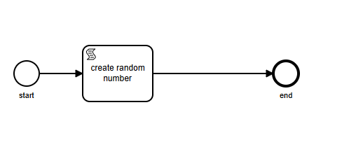
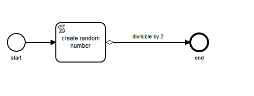

# VBD WF Engine Flow 

**Flow** trong **VBD Workflow Engine** có 2 kiểu auto và condition. 
## Auto  
flow sẽ chạy không có điều kiện 

- Run workflow
```console
start run
create random number run
create random number 2
end run
[       OK ] test.multi_instance (95 ms)
```
# Condition
flow sẽ chạy activity tiếp theo nếu output của flow đó là true

- Run workflow
- condition false
```console
activity start run
create random number run
create random number 9
Random num: 9
9 is not divisible by 2
```
- condition true
```console
activity start run
create random number run
create random number 0
Random num: 0
0 is divisible by 2
activity end run
```
# Script 
```js title="/src/components/start.js"
console.log('activity start run'); 
```
```js title="/src/components/create random number.js"
function getRandomInt(max) {
  return Math.floor(Math.random() * max);
}
 console.log(activity.name + ' run'); 
let num = getRandomInt(10); 
console.log('create random number' + ' ' + num); //create random 1-3 
activity.setOutput(num); 
```
```js title="/src/components/end.js"
console.log('activity end run'); 
```