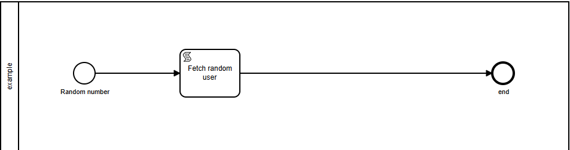

# Example

Ví dụ xây dựng 1 workflow trong **Workflow Engine**.
## Workflow example

### Sử dụng bpmn tạo wf 
- Add event listener (javascript) cho activity **Random int**
```js title= "Random int"
function getRandomInt(max) {
  return Math.floor(Math.random() * max);
}
 console.log(activity.name + ' run'); 
let num = getRandomInt(3); 
console.log('create random number' + ' ' + num); //create random 1-3 
activity.setOutput(num); 
```   
- Add script task (javascript) cho activity **Fetch random user**    
```js title= "Random int"
let random_number = engine.getOutput({
    processid : 'Process_1',
    activityid : 'StartEvent_1'}); 
console.log('random number create from activity StartEvent_1' + ' ' + random_number); 
//fetch random user 
console.log(activity.name + ' run'); 
let url = 'https://randomuser.me/api/?results=$number'; 
url =  url.replace("$number", random_number);
console.log(url); 
const requestOptions = {
    method: 'GET', 
    headers: {
        'Content-Type': 'application/json',
    }
};
engine.fetch(url,requestOptions)
.then(result => {
    let obj = JSON.parse(result.text); 
    console.log(JSON.stringify(obj)); 
}).
catch(error => {
    engine.error('fetch error'); 
}); 
```   
- Add script task (javascript) cho activity **end** 
```js title= "End"
console.log(activity.name + ' run'); 
```   
console 
```console 
Random number run
create random number 0
random number create from activity StartEvent_1 0
Fetch random user run
https://randomuser.me/api/?results=0
{"results":[{"gender":"female","name":{"title":"Miss","first":"Ramya","last":"Babu"},"location":{"street":{"number":4135,"name":"Tripolia Bazar"},"city":"Pallavaram","state":"Tamil Nadu","country":"India","postcode":27382,"coordinates":{"latitude":"4.7537","longitude":"24.8346"},"timezone":{"offset":"-4:00","description":"Atlantic Time (Canada), Caracas, La Paz"}},"email":"ramya.babu@example.com","login":{"uuid":"91446fbd-3328-4993-bb3e-ab7f7c5e9721","username":"tinymouse737","password":"chris","salt":"ojGLJlTR","md5":"8fe9d867d1d50d7caa9d905ed4f92551","sha1":"4b2fe7c4d0a206d1ee1c19294eef920daaf478c3","sha256":"9221daefacb77d92efabb6683f197d0b92d94433777189a1d1d8e0cb35e495a0"},"dob":{"date":"1970-01-11T08:01:54.764Z","age":54},"registered":{"date":"2022-05-13T19:50:53.794Z","age":2},"phone":"9395410346","cell":"7499349472","id":{"name":"UIDAI","value":"639149732065"},"picture":{"large":"https://randomuser.me/api/portraits/women/43.jpg","medium":"https://randomuser.me/api/portraits/med/women/43.jpg","thumbnail":"https://randomuser.me/api/portraits/thumb/women/43.jpg"},"nat":"IN"}],"info":{"seed":"e989cc45b484c19e","results":1,"page":1,"version":"1.4"}}
end  run
```