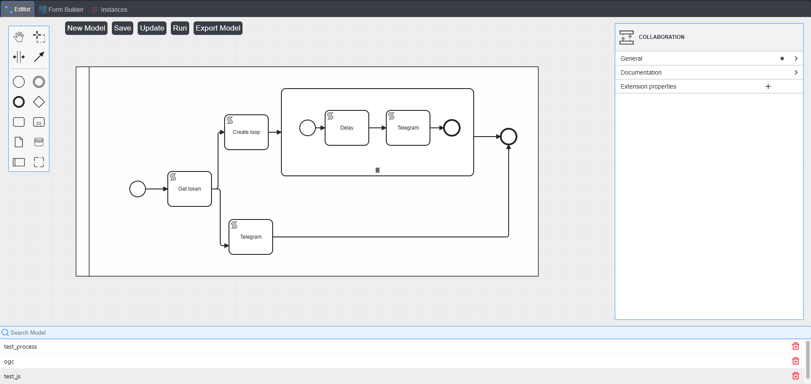

# 🌟 Giới thiệu về Workflow

**Workflow** là một chuỗi các công việc hoặc tác vụ được tổ chức và thực hiện theo một trình tự cụ thể để đạt được mục tiêu đã định. Việc sử dụng workflow không chỉ giúp tối ưu hóa quy trình làm việc mà còn nâng cao hiệu suất và giảm sai sót.

---

## 📌 **Workflow là gì?**

Workflow là một sơ đồ minh họa cách các công việc được thực hiện theo từng bước. Nó có thể được chia thành ba loại chính:

1. **Sequential Workflow**: Các bước thực hiện tuần tự.
2. **Parallel Workflow**: Các bước có thể thực hiện đồng thời.
3. **State Machine Workflow**: Quy trình được dẫn dắt bởi các trạng thái.

---

## 🔥 **Lợi ích của Workflow**

- **Tăng hiệu suất**: Giúp giảm thời gian thực hiện công việc.
- **Cải thiện chất lượng**: Tự động hóa các bước để giảm thiểu sai sót.
- **Quản lý dễ dàng**: Theo dõi và điều chỉnh quy trình làm việc nhanh chóng.
- **Hợp tác hiệu quả**: Các thành viên dễ dàng hiểu và thực hiện vai trò của mình.

> 🌟 "Một workflow rõ ràng là chìa khóa cho sự thành công trong bất kỳ dự án nào." 

---

## 🛠 **Ứng dụng thực tế**

1. **Quản lý dự án**: Trello, Jira, Asana.
2. **Marketing**: Tự động hóa email, quản lý chiến dịch.
3. **Phát triển phần mềm**: CI/CD (Continuous Integration/Continuous Delivery).

---

## 🌈 **Một ví dụ về Workflow**

_Biểu đồ minh họa quy trình làm việc trong một hệ thống tự động hóa._

---

## 🖥 **Công cụ tạo Workflow**

### 1. **VbdWorkflow**
- Hệ sinh thái **Vietbando** đáp ứng mọi nhu cầu trong việc hiện thực hóa suy nghĩ của bạn.

### 2. **Camunda**
- Một nền tảng mạnh mẽ để thiết kế và triển khai workflow.

### 3. **Apache Airflow**
- Dành cho quản lý và lập lịch công việc dựa trên code.

### 4. **Zapier**
- Tự động hóa các tác vụ hàng ngày giữa các ứng dụng mà không cần mã.

---

## 📜 **Kết luận**

Workflow là một yếu tố không thể thiếu để tối ưu hóa quy trình làm việc. Dù bạn đang làm việc trong lĩnh vực nào, áp dụng workflow phù hợp sẽ giúp bạn đạt được hiệu quả cao nhất.

🎯 **Hãy bắt đầu xây dựng workflow của riêng bạn ngay hôm nay!**
    
---

#### 📧 Liên hệ
Nếu bạn cần tư vấn thêm, hãy liên hệ với chúng tôi qua: 

    *http://maps.vietbando.com/maps/contact*
