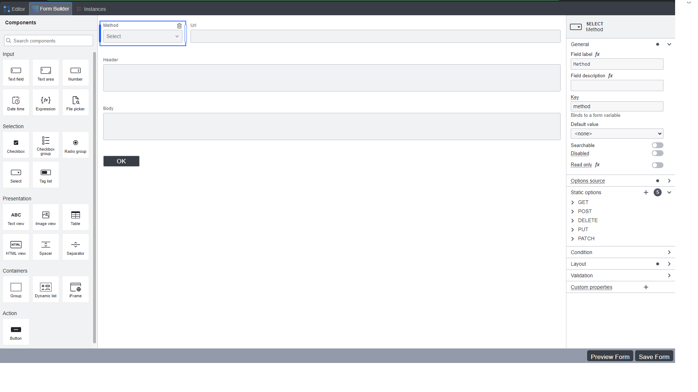
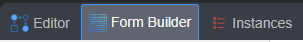
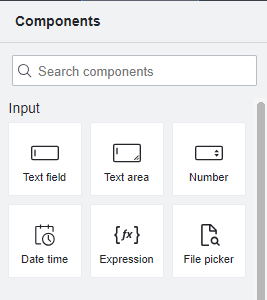
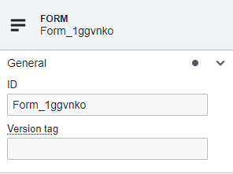

# 🌟 Hướng dẫn tạo form workflow

# Hướng dẫn tạo Workflow Form trên trang web chính của VBD workflow

## I. Lợi ích việc tạo Form trên VBD workflow
- **Tạo form thu nhập thông tin** một cách dễ dàng và nhanh chóng.

## II. Cách tạo Workflow Form chuyên nghiệp

### 1. Hướng dẫn Chi tiết
1. **http://10.225.0.238:86/**:
   - Vào trang web của VBD workflow.
   - Chọn tab **Form Builder** ở góc trên bên trái dưới thanh địa chỉ

         

2. **Tạo nội dung cho form**:
   - Ở bên trái màn hình chính sẽ hiển thị tool box của các **Components**
   - Kéo thả các **Components** hoặc double click để tạo form

      

3. **Cấu hình cho các Components**:
   - Click vào **Component** cần chỉnh sửa
   - Properties panel của component sẽ hiển thị ở bên phải màn hình chính
   - Tùy thuộc vào component mà chỉnh sửa cho phù hợp

      

4. **Preview Form**:
   - Ở góc phải bên dưới màn hình có button **Preview Form**, click vào để hiện thị form demo
5. **Lưu Form**:
   - Button **Save Form** sẽ nằm ngay cạnh **Preview Form**, click vào và nhập tên form để lưu lại

### 🎉 Bùm! Đã xong rồi! 🎉
Bạn đã hoàn thành việc tạo Workflow Form một cách đơn giản nhất! 🚀

### 2.Video Demo
Xem video dưới đây để biết thêm chi tiết về cách sử dụng chức năng này:
[Video Demo Tìm Đường ](https://www.youtube.com/watch?v=QTfcV25kHE8)

<iframe width="950" height="535" src="https://www.youtube.com/embed/QTfcV25kHE8?si=-GTmnxxaHW_hN4ff" title="YouTube video player" frameborder="0" allow="accelerometer; autoplay; clipboard-write; encrypted-media; gyroscope; picture-in-picture; web-share" referrerpolicy="strict-origin-when-cross-origin" allowfullscreen></iframe>

## III. Kết luận
Chức năng **Tạo form** là một chức năng quan trọng bậc nhất đối với việc tạo và sử dụng workflow
