# 🌟 Hướng dẫn tạo model
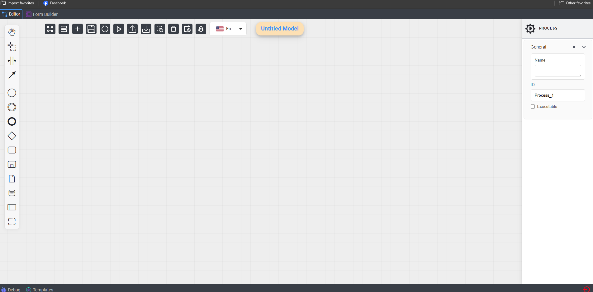
# Hướng dẫn tạo model trên trang web chính của VBD workflow

## I. Giới thiệu các thành phần của trang web
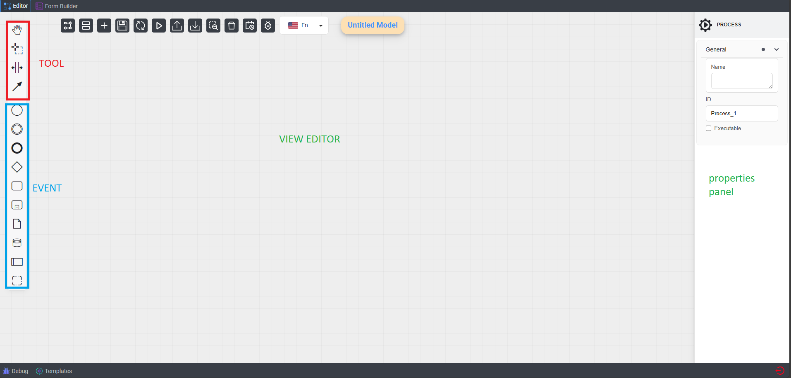
   * Một số thành phần khác 
      - Dialog property của activity

         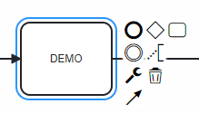
      - Dialog popup của activity 

         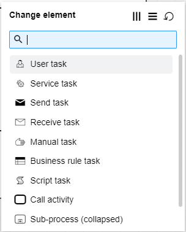
      - Dialog property của Start Event

         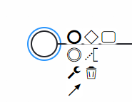
      - Dialog property của End Event

         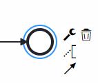
      - Dialog property của process

         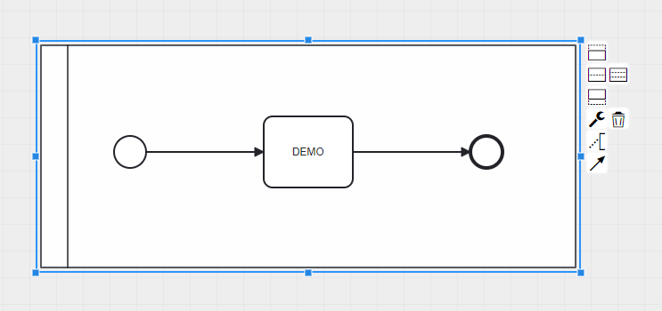
## II. Cách tạo model đơn giản nhất

### 1. Hướng dẫn Chi tiết
1. **http://10.225.0.238:86/**:
   - Vào trang web của VBD workflow.
   - Chọn tab **Editor** ở góc trên bên trái dưới thanh địa chỉ

         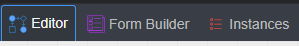

2. **Tạo nội dung cho model**:
   - Ở bên trái màn hình chính sẽ hiển thị tool và event panel
   - Kéo thả các **Event** hoặc click thả để tạo model
         

3. **Cấu hình cho các Event**:
   - Click vào **Event** cần chỉnh sửa
   - Properties panel của Event sẽ hiển thị ở bên phải màn hình chính
   - Tùy thuộc vào Event mà chỉnh sửa cho phù hợp

   **a. Một số property của các Event**
   - Activity

      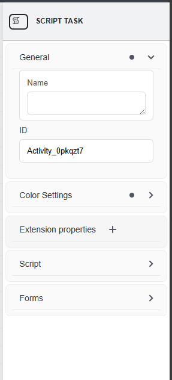

   - Process

      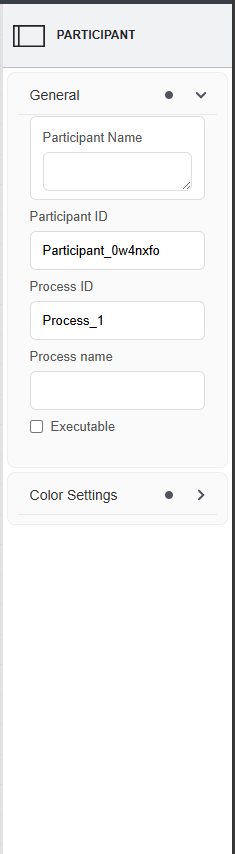

   - SubProcess

      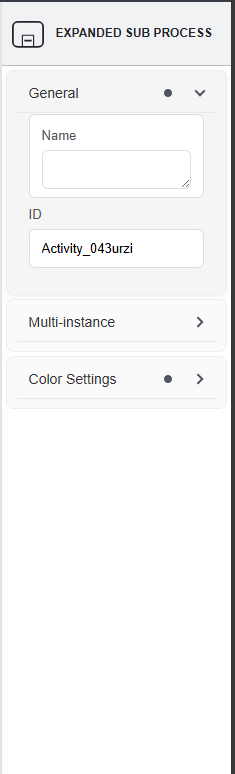

4. **Lưu Model**:
   - Button **Save Model** sẽ nằm ở vị trí thứ 3 từ trái qua của Action Controller, click vào và nhập tên model để lưu lại

### 🎉 Bùm! Đã xong rồi! 🎉
Có phải rất đơn giản không ! 🚀

### 2.Video Demo
Xem video dưới đây để biết thêm chi tiết về cách sử dụng chức năng này:
[Video Demo ](https://www.youtube.com/watch?v=Yv0sB1XC_8o)

<iframe width="950" height="535" src="https://www.youtube.com/embed/Yv0sB1XC_8o" title="HƯỚNG DẪN TẠO MODEL BẰNG VIETBANDO WORKFLOW WEB" frameborder="0" allow="accelerometer; autoplay; clipboard-write; encrypted-media; gyroscope; picture-in-picture; web-share" referrerpolicy="strict-origin-when-cross-origin" allowfullscreen></iframe>

## III. Kết luận
Chức năng **Tạo Model** là một chức năng quan trọng bậc nhất đối với việc tạo và sử dụng workflow
