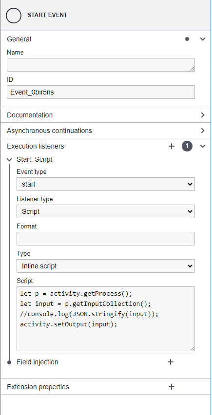

# ✍ Hướng dẫn viết script cho các Activity

### 🔄 I. Process
#### 1. Trả về object của process đang chứa activity
```javascript
let p = activity.getProces();
```

#### 2. Trả về ID của process đang chứa activity
```javascript
let p = activity.getProces();
let id = p.id;
```
Hoặc:
```javascript
let id = activity.getProces().id;
```

### 🌐 II. Activity
#### 1. Trả về object của activity
```javascript
let activity_obj = engine.getActivity({ processid: "id của process", activityid: "id của activity" });
```
**👀 LƯU Ý:**
- Có thể đặt tên biến tùy thích cho `activity_obj`, thường sẽ đặt theo chức năng của activity.
- ID của process phải được lấy theo cách ở mục I.2 nếu activity đang nằm trong subprocess.
- ID của process có thể lấy trực tiếp từ model nếu activity đang nằm trong process chính (VD: `Process_1`).

#### 2. Lấy input và output của activity
**a. Lấy input của chính nó (trả về object)**
```javascript
let input = activity.getInput().{id của activity trước nó};
// Ví dụ:
let input = activity.getInput().Activity_0g4u65q;
```
Hoặc:
```javascript
let input = activity.getInput()['id của activity trước nó'];
// Ví dụ:
let input = activity.getInput()['Activity_0g4u65q'];
```
**👀 LƯU Ý:** Input của một activity có thể được nhận từ nhiều activity khác, do đó phải luôn xác định ID của activity trước nó.

**b. Lấy input của chính nó từ form (trả về object, đối với activity có form)**
```javascript
let input_form = activity.getInput().form;
```

**c. Lấy input của activity khác**
- Tương tự như mục II.2.a, thay `activity` bằng biến object của activity khác (phải khởi tạo trước).
```javascript
// Ví dụ:
let activity_obj = engine.getActivity({ processid: "id của process", activityid: "id của activity" });
let input_activity_obj = activity_obj.getInput().Activity_3238ugk;
```

**d. Lấy input của activity khác từ form**
- Tương tự như mục II.2.c

**e. Lấy output của activity khác (trả về object)**
```javascript
let activity_obj = engine.getActivity({ processid: "id của process", activityid: "id của activity" });
let output = activity_obj.getOutput();
```

#### 3. Set output cho activity (set cho chính nó)
```javascript
activity.setOutput(object_param);
```

### 🔁 III. Subprocess
**👀 LƯU Ý:**
- Input của subprocess là array JSON, mỗi instance của subprocess sẽ lấy một object trong array.
- Luôn thêm 3 dòng code sau cho **START ACTIVITY** bằng cách:
       - Chọn theo thứ tự : Excution Listener -> start -> script -> inline script -> Thêm code :
   
```javascript
let p = activity.getProcess();
let input = p.getInputCollection();
activity.setOutput(input);
```

### 📝 IV. Form
#### 1. 👀 LƯU Ý
- Khá tương tự như JavaScript, nhưng các "cụm từ" định nghĩa trong form sẽ được **REPLACE** bằng giá trị tương ứng, không phải là biến.

#### 2. Cấu hình giá trị truyền vào cho các trường của form
- **Gán các trường(field) trong object của input, output của các activity ở trong cùng một process ( cả subprocess và process chính)**
```javascript
{{processdata."id của activity".input.field}}
{{processdata."id của activity".output.field}}
//Ví Dụ : 
{{processdata.Activity_0i8cl7a.input.id}}
{{processdata.Activity_0i8cl7a.output.name}}
```
- **Gán các trường(field) trong object của input, output của các activity ở process chính cho form của activity trong subprocess**
```javascript
{{dataprocess.dataprocess."id của activity".input.field}}
{{dataprocess.dataprocess."id của activity".output.field}}
//Ví Dụ : 
{{dataprocess.dataprocess.Activity_0i8cl7a.input.id}} 
{{dataprocess.dataprocess.Activity_0i8cl7a.input.adress}}
```
### 📝 V. Engine
- **data**
	- **addGlobalData**
		Workflow engine cho phép khởi tạo global data để sử dụng cho tất cả các activity: 
	```javascript
	let globalUserData = {
		username : "admin",
		password : '123456'
	}; 
	engine.addGlobalData('userConfig',globalUserData); 
	```
	- **getGlobalData**
	```javascript
	let userConfig = engine.getGlobalData().userConfig; 
	```
- **Exception**
Sử dụng **EngineThrowException** để try-catch lỗi. bắt workflow dừng ngay chỗ activity mong muốn
```javascript
let str = 'Error'; 
EngineThrowException(activity,str); 
```
#### 1. Các extenstion mà engine hỗ trợ:
- **fetch**: 
	- **example:**
	```javascript
	const url = 'https://jsonplaceholder.typicode.com/todos/1'; 
	const headers =
	{
	}; 
	    
	const body =
	{
	};

	const response = fetch(url,{
	    headers,
	    body,
	    method: 'GET'
	}); 


	if(response.ok === true)
	{
	    const result = JSON.parse(response.text);
	    console.log(result); 
	    activity.setOutput(result); 
	}
	else 
	{
	    //throw new error pause wf 
	    EngineThrowException(activity,result.text); 
	}
	```
	- **fetch với payload:**
	```javascript
	   const headers =
       {
           'Content-Type': 'application/x-www-form-urlencoded'
       }; 
           
       const body =
       {
           grant_type: 'password',
           username: 'admin',
           password: 'vbd1@a'
       };
       
       const result = fetch(url,{
           method: 'POST',
           headers: headers,
           Payload: body
       }); 
	```
- **console**: 
		Sử dụng console.log và console.error để debug
	```javascript
	let text = 'text'; 
	console.log(text); 
	console.error(text); 
	```
### 📝 VI. Các chế độ mà engine hỗ trợ
Server workflow của VBD hỗ trợ hai chế độ thực thi chính: **async** và **await**. Với chế độ **async**, khi gửi một yêu cầu API, server sẽ ngay lập tức phản hồi với thông báo "run workflow success" mà không cần chờ workflow hoàn tất. Điều này phù hợp cho các tác vụ không đòi hỏi kết quả ngay lập tức, giúp tối ưu tốc độ phản hồi. Ngược lại, chế độ **await** sẽ giữ kết nối cho đến khi toàn bộ workflow hoàn tất và trả về kết quả cuối cùng. Chế độ này hữu ích khi bạn cần đảm bảo workflow chạy xong và nhận được đầy đủ dữ liệu trước khi tiếp tục xử lý.
- **Các hàm hỗ trợ cho từng chế độ chạy**
	- **engine.addResult(key,obj)**
	```javascript
	let data = {responseData : 'username'}
	engine.addResultData('user_data', data); 
	```
	khi thực thi xong workflow trên server server sẽ trả về : 
	```json
	{
			"instance":  "67bebc1ec6890c5c85053bd2",
			"code":  200,
			"message":  "start success",
			"result":  {
			"user_data":  {
				"responseData":  "username"
				}
			}
	}
	```
	Workflow engine sẽ trả thêm kết quả mà mà bạn add vào trong engine.
	


