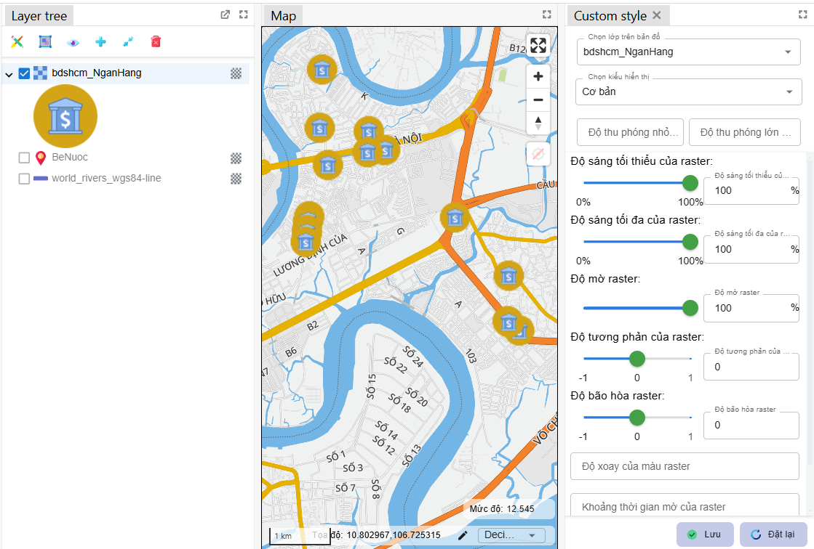
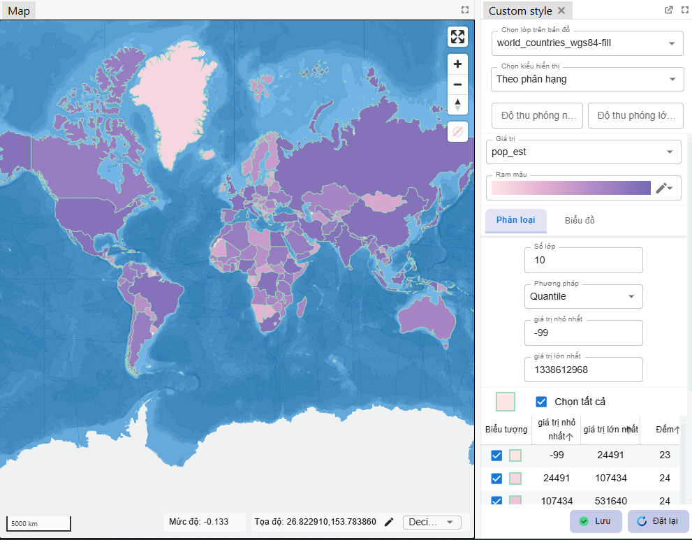
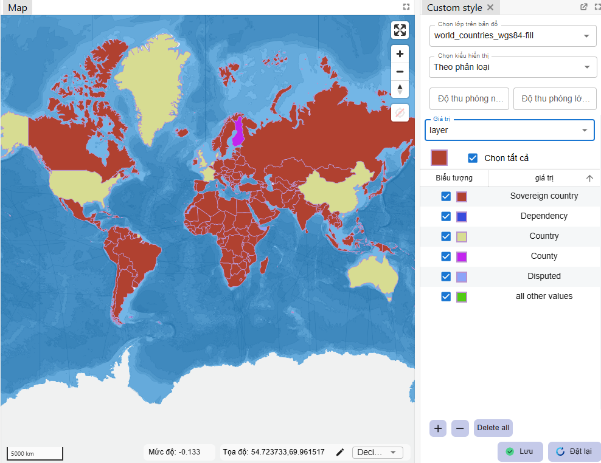

import styleSymbol from "../images/layer_style_panel/symbol_style_ex.png";
import styleLine from "../images/features/edit_style_line_example.png";
import styleFill from "../images/features/edit_style_example.png";

### 1. Layer Tree.

List of layers are displayed as a tree like this:

The features of layer tree:

- [Layer opacity](/en/docs/vietbando_gisonline/guides/layer_tree#29-change-the-opacity-of-layer)
- [Zoom to layers](/en/docs/vietbando_gisonline/guides/layer_tree#26-zoom-to-layers)
- [Open edit style panel](/en/docs/vietbando_gisonline/guides/layer_style_panel)
- [Drag and drop items in layer tree](/en/docs/vietbando_gisonline/guides/layer_tree#23-drag-and-drop-items)
- [Hide/show layers](/en/docs/vietbando_gisonline/guides/layer_tree#24-showhide-items)
- Toggle editting of layer GEOJSON
- Add layers to map compare.
- Open the filter dialog
- Open the table of attributes of data
- [Rename layers or groups](/en/docs/vietbando_gisonline/guides/layer_tree#27-rename-layers-or-groups)
- [Save data to file .shp or .geojson](/en/docs/vietbando_gisonline/guides/layer_tree#210-some-other-functions)

### 2. Edit style layers.

The user can edit style of layers in panel. Each type of layers has own list of appropriate inputs with it.

List available types of layers to edit style: Fill, Line, Symbol, Raster, Rain Layer, Weather Layer, Circle, Fill extrusion.

#### 2.1. Edit simple style.
  
    + Fill layer

    + Line layer

    + Symbol layer

    + Raster layer

#### 2.2. Edit style with graduating layers (only with GEOJSON)

#### 2.3. Edit style with categorizing layers (only with GEOJSON)

