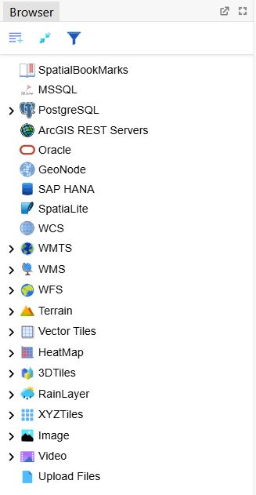
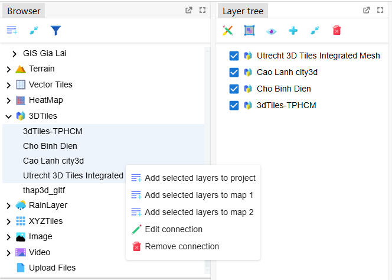

import BrowserPanel from '../../../../src/BrowserPanel/browser_panel_database_entries.tsx';
import BrowserTilesServices from '../../../../src/BrowserPanel/browser_tile_servies.tsx';
import BrowserOtherServices from '../../../../src/BrowserPanel/browser_other_services.tsx';
import Addtolist  from  '../images/panel/addtolist.svg';
import Collapse  from  '../images/panel/collapse.svg';
import Filter  from  '../images/panel/filter.svg';
import OpenFilterSearchBox  from  '../images/panel/open-filter-search-box.png';
import FilterBrowserTree  from  '../images/guides/filter_browser_tree.png';

## 1. Browser Toolbar.

 Toolbar items of Browser Tree:
- <Addtolist width={25} height={25} style={{marginBottom:"-0.5rem"}}/> Add selected layers to Layer Tree and show on the main map.
- <Collapse width={25} height={25} style={{marginBottom:"-0.5rem", marginTop:"0.5rem"}}/> Collapse all the nodes in tree
- <Filter width={25} height={25} style={{marginBottom:"-0.5rem", marginTop:"0.5rem"}}/> Open filter search box to look up related nodes in the tree.
  - Click filter button  <Filter width={20} style={{marginBottom:"-1.25rem"}}/>, open search box like below
  
  - Input text to find nodes that has respective content in the tree:
  

## 2. Browser Tree.

Browser Tree includes many connections items that users add in many types of services such as PostgreSQL, WFS, WMS, VectorTiles, XYZTiles... Since then, users can open many layers from these connections and add them in the map to observe, edit data of these layers.

The first items of of BrowerTree are types of connections to layers includes:
    - PostgreSQL
    - MSSQL
    - WFS
    - WMS
    - WMTS
    - WCS
    - Terrain
    - VectorTiles
    - XYZTiles
    - 3DTiles
    - RainLayer
    - Image
    - HeatMap
    - SpatialLite
    - SAP HANA
    - GeoNode
    - Video
    - Upload Files (Users upload files that includes geometry information from personal devices like shapefile, .geojson, .zip, .json, .dbf, ...)
    - Oracle

Users click with right mouse at expected items, a menu show up and includes some options like this:
- _**Add a connection**_: Open a dialog to input the information of connections with differents types of services and save the connection in browser tree. Users can load layers from these connections.
- _**Load connections**_: User reset layers and items inside the connections.
- _**Remove connections.**_
- _**Expand children**_: Expand children items of focus item in tree.
- _**Edit connections**_:Open dialog that includes the information of connections again and edit these information.
- _**Add selected layers to project**_: Add selected layers to main map and show them in the layer tree.
- _**Add selected layers to map 1  / Add selected layers to map 2**_: Add selected layers to compare map.
- _**Export data GEOJSON to shapeFile or .geojson file**_: Export data to file and save in personal devices.

Users can select multiple items with 2 methods:
- Hold the Ctrl (control) key and click on each item (using the mouse/trackpad) to select multiple items simultaneously.,
- Use the Shift key to select a range of items. Click on the first item. This will define the beginning of the range.
Hold the shift key and click on the last item in the range. All items from the first to the last will be selected

After that, user click right mouse to show menu, if the clicked focus item is a layer, users can add all the selected items that are layers to the map with the options _"Add selected layers to project"_ or _"Add selected layers to map"_.

Dưới đây là các lựa chọn xuất hiện sau khi nhấn chuột phải đối với các mục trên cây Browser Tree.
### 2.1. Database entries

<BrowserPanel />

### 2.2. Tile Services

<BrowserTilesServices />

### 2.3. Other Services

<BrowserOtherServices />