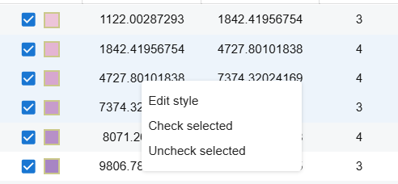

import graduated_style_ex from '../../images/layer_style_panel/graduated_style_ex.png';
import button_add_row from '../../images/layer_style_panel/button_add_row.png';
import button_remove_row from '../../images/layer_style_panel/button_remove_row.png';
import button_delete_all_row from '../../images/layer_style_panel/button_delete_all_row.png';
import show_edit_style_row_selected from '../../images/layer_style_panel/advance_edit/show_edit_style_row_selected.png';
import show_all from '../../images/layer_style_panel/advance_edit/show_all.png';
import result_edit_selected_row from '../../images/layer_style_panel/advance_edit/result_edit_selected_row.png';
import show_button_edit_all from '../../images/layer_style_panel/advance_edit/show_button_edit_all.png';
import graduated_in_node from '../../images/layer_style_panel/advance_edit/graduated_in_node.png';
import categorized_style_ex from '../../images/layer_style_panel/advance_edit/categorized_style_ex.png';
import show_menu_class_graduated_node from '../../images/layer_style_panel/advance_edit/show_menu_class_graduated_node.png';
import show_dialog_edit_style_graduated_node from '../../images/layer_style_panel/advance_edit/show_dialog_edit_style_graduated_node.png';
import show_histogram_edit from '../../images/layer_style_panel/advance_edit/show_histogram_edit.png';
import show_selected_features_histogram from '../../images/layer_style_panel/advance_edit/show_selected_features_histogram.png';

With the layer of GEOJSON data, users can observe layers in different display types depending on the characteristics of the attributes in the data. Below are instructions on how to display layers when selecting these specific display types.

### 1. Display with graduating data.

With attributes that have numeric values ​​in GEOJSON data, users can observe the variation of this attribute through the characteristics of layer characteristics shown on the map as shown below:

#### 1.1. The graduated table

Inputs the user needs to enter include:

- **_Value_**: The name of attribute user need to select to get value to observe the variation in the data of layer. Here, attributes with numeric values ​​are available for users to choose.
- **_Color ramp_**: The color ramp represents the increment of the value assigned to the color characteristic of the display layer.
- **_Number of classes_**: The number of partition values ​​for the attribute in the data is divided from low to high for displaying on the map.
- **_Method_**: The method to divide the data partition value to each layer for display on the map:
    + Quantile: Each class has an almost equal number of elements
    + Equal interval: Each class has the same size.
- **_Min value_**: Starting value to partition the data, default is the smallest value in the data.
- **_Max value_**: Ending value to partition the data, default is the largest value in the data.

Information about divided data areas is shown in a table with 4 columns as shown in the picture, each row corresponds to a divided area:

- **_Symbol_**: The icon represents the divided data area shown on the map. Users can turn this data area on or off on the map by clicking the checkbox next to this icon. Users click on this icon to switch to the basic editing window for this row's partition like below.

 

- **min value**: The starting value of that data partition.
- **_max value_**: The ending value of that data partition..
- **_Count_**: The number of features in the data corresponds to the divided data area.

Actions users can perform with the data table:

- Users can use ctrl or shift combined with mouse click to select multiple lines.
- Users can edit the minimum and maximum values ​​of each row in the table.
- Users click  to add a partition data to graduate.
- After selecting multiple lines, users can click  to remove these rows.
- Users can click  to remove all rows.
- After selecting lines, users can right-click on that line to display a list of options as follows:
  
  
  + _**Edit style**_: The screen switches to the basic editing window of the current layer type, the map will display the selected partitions corresponding to the content just edited in this window, the user press **Save** to save and go back to the board, press **Reset** to go back to the board.
   
   
  + **_Check selected_**: Show features in the data corresponding to selected rows in layers on the map
  + **_Uncheck selected_**: Hide features in the data corresponding to selected rows in layers on the map.
- Users can change the entire display of rows by clicking the icon at the top of the table as follows:

The window switches to the basic editing style window as above and the user can change the style for all partitions.
- Users can hide/show all partitions by clicking on the checkbox  above of the table.

##### Display graduated layer in the layer tree

After graduating data, at the tree of layers, the partitions of this table will be displayed under the layer item as follows:

Here, users can show/hide data categories when pressing the box before each category:

Users can click with right-mouse on each classification item to display the following options:

  
  - **Copy value**: Copy the value of that classification item as text: minimum value, maximum value.
  - **Change style**: Opens a dialog box for the user to edit the display for the selected classification item in that layer. The user presses **Agree** to save and show, **Cancel** to return:
     

#### 1.2. Histogram.

In addition, the data of the selected attribute will be presented as a Histogram as shown below:

The user can edit the corresponding number of bins on the chart for the numeric data of the selected attribute.

The user can drag the mouse to change the display layer area corresponding to the selected data range on the chart as follows:

### 2. Display with categorizing data

For each attribute in the data, the attribute values ​​will divide the data into groups with similar values ​​and the layer on the map will display the groups as shown below:

The user selects the attribute name of the data in the **Value** section to classify data at this attribute. The layer on the map is initially represented with colors corresponding to the value of the selected attribute of each element in the data.

A table appears as shown above containing the partitioned values ​​of the data. Operations on this table will be similar to the table in [Display in graduating data](#11-the-graduated-table).

In the layer tree, the classification item will be shown as [display graduated layer in layer tree](#display-graduated-layer-in-the-layer-tree) with similar operations.