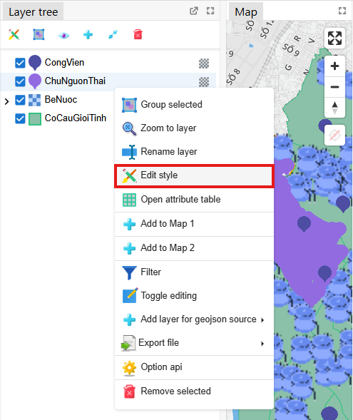
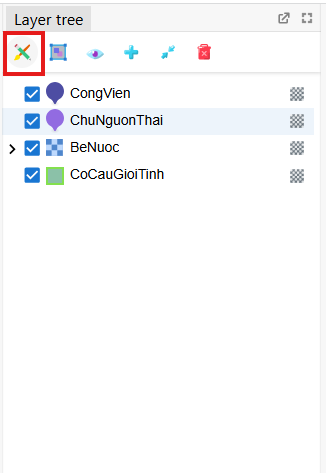
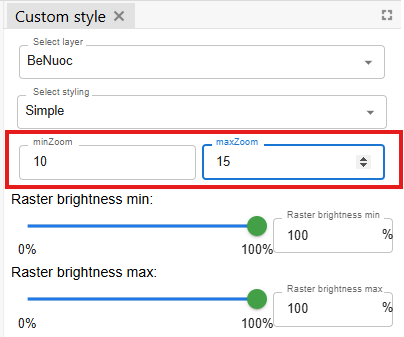
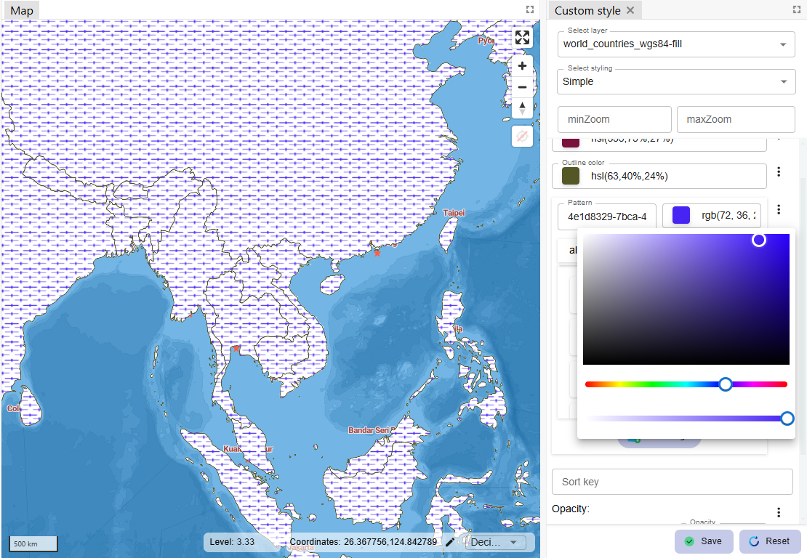

import TableEditStyleType from '../../../../../src/LayerStyle/TableEditStyleType';
import select_layer_style_panel from '../../images/layer_style_panel/select_layer_style_panel.png';
import style_fill_pattern from '../../images/layer_style_panel/style_fill_pattern.png';
import style_icon_list from '../../images/layer_style_panel/style_icon_list.png';
import add_image_dialog from '../../images/layer_style_panel/add_image_dialog.png';
import save_button from '../../images/layer_style_panel/save_button.png';
import reset_button from '../../images/layer_style_panel/reset_button.png';

The style editing panel contains inputs to change style of layers, how layers are displayed on the map such as color selection, changing opacity, line thickness, spacing, etc. And users can see layers as desired.

## 1. Open panel

There are 2 ways users can open the panel:

 1. Open from right-clicked menu at the item of layer in layer tree:

 2. Click the button of editting style from the toolbar of layer tree:

## 2. Select a layer

Users clicked and select a layer from the list to edit style of that layer like below:

## 3. Edit zoom to show layers

The user edits the minimum and maximum zoom of the map. Based on these 2 values, the map displays that layer in the range between 2 zoom levels, by default the smallest zoom value is 0, the largest zoom value is 25.

## 4. Types of layers
For each type of layer, there will be different display types as follows:

<TableEditStyleType />

Users can select type of displaying layer at the panel. Default type is simple.

## 5. List of images for styling layer

The program uses some set of available images that allow users to apply to draw layers on the map as follows:

* List of images used for polygon or line layers:

With the pattern having just white and black, the user can change the color black of that pattern to other colors when inputs color at change-color button at the right of list as follows:

* List of images used for symbol layers:

For each set of photos, users can add images by clicking _**Add image**_ button below each set, the screen displays a dialog box for users to add as follows:

After adding photos and entering all information, users click _**Ok**_ to add image to the list, press _**Cancel**_ to return.

## 6. Save and reset.

After editing, user can click **Save**  to save the latest edting state,or click **Reset**  to return the latest saved state.