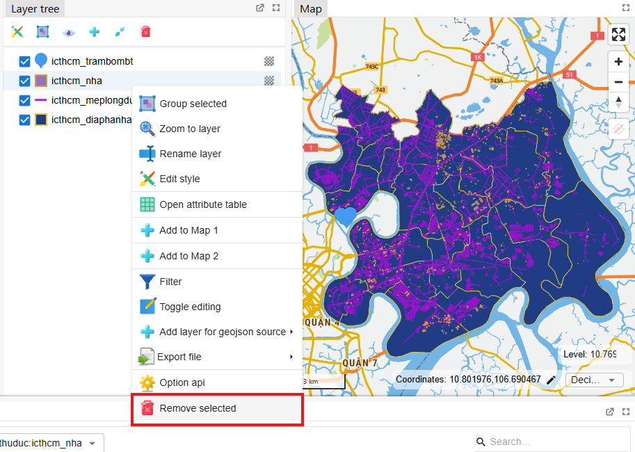
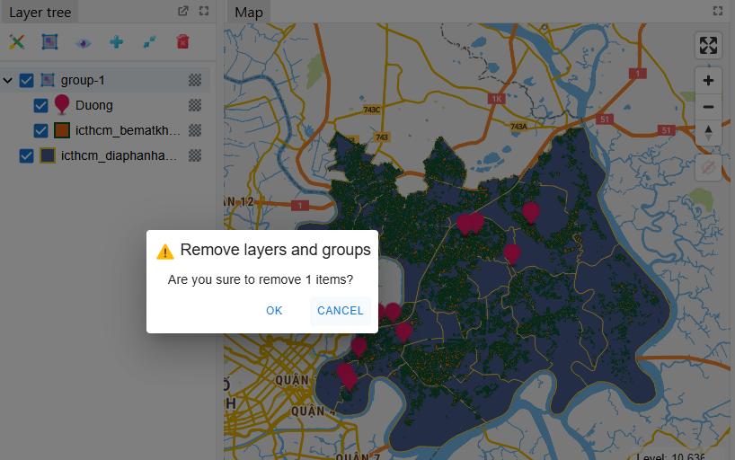
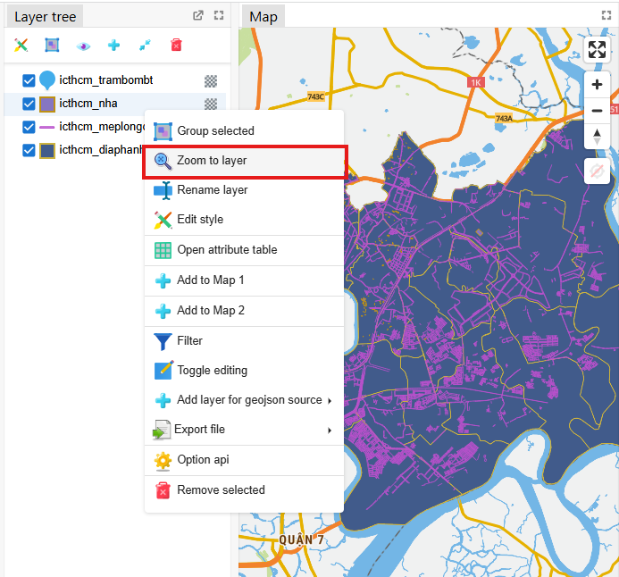
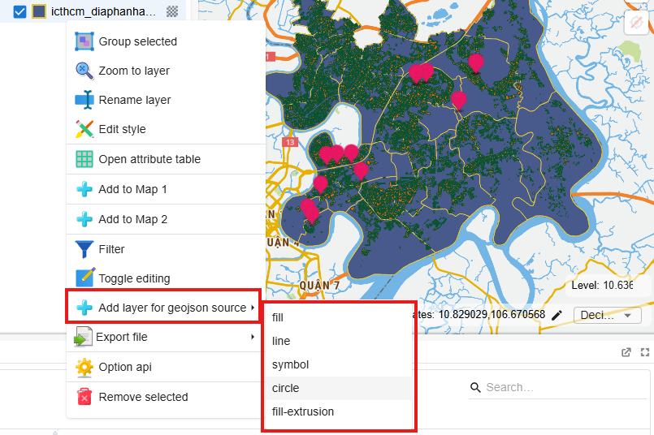

import ListToolbarLayerTree from '../../../../src/LayerTree/toobar_list_layer_tree.tsx'
import Translate from '@docusaurus/Translate';
import Group from "/img/layer_tree/group.svg";
import Pencil from "/img/layer_tree/pencil.svg";
import CircleWarning from "/img/layer_tree/circleWarning.svg";
import Grid from "/img/layer_tree/grid.svg";
import Loading from "/img/layer_tree/loading.svg";
import Eye from '../images/layer_tree/eye.svg';
import Polygon from "/img/layer_tree/polygon.svg";
import MultiLine from "/img/layer_tree/multiLine.svg";
import Opacity from "/img/layer_tree/opacity.svg";
import Point from "/img/layer_tree/point.svg";
import groupLayerExample from "../images/layer_tree/group_layer_example.png";
import result_group_example from "../images/layer_tree/result_group_example.png";
import group_from_menu_example from "../images/layer_tree/group_from_menu_example.png";
import HideShowOptions from '../images/layer_tree/hide_show_options_layers.png';
import videoDragLayers from "../images/layer_tree/drag_layers_example.mp4"
import ShowLayerExample from "../images/layer_tree/show_layer_ex.png"
import hideLayerExample from "../images/layer_tree/hide_layer_ex.png"
import hideGroupExample from "../images/layer_tree/hide_group_ex.png"
import showStartRenameLayer from "../images/layer_tree/show_start_rename_layer.png"
import showResultRenameLayer from "../images/layer_tree/show_result_rename_layer.png"
import showGroupExample from "../images/layer_tree/show_group_ex.png"

The layer tree is a list of map layers containing information about the map layers added from the browser tree. The tree represents the display status and properties of the layers shown on the map. Users can interact with this tree to change layers as desired on the map.

## Select items

Users can select multiple layers at once in the following ways
- Left click to select a layer
- Hold the Ctrl (control) key and click on each item (using the mouse/trackpad) to select multiple items simultaneously.,
- Use the Shift key to select a range of items. Click on the first item. This will define the beginning of the range.
Hold the shift key and click on the last item in the range. All items from the first to the last will be selected

Selected items will be highlighted compared to unselected items.
After selecting multiple layers, users can interact with these layers with the toolbar above the window or right-click on a layer to display a list of options for interaction.
## 1. Toolbars

The top of the window includes a toolbar containing a number of features to help users interact with the layers below as desired.

Specific features are as follows:

<ListToolbarLayerTree />

## 2. Layer tree

Users add layers from data source connections in the browser tree or add a new data layer with the _**Add New**_ button in the Toolbar at the top of the website. The map layers tree contains an ordered list of layers and the corresponding layer styles and states shown on the map. Below are the user interactions that can be performed with the layer tree.

### 2.1. The state of the items in the tree

Below are the special statuses of items in the tree with the following icons:
- <Group width={25} style={{marginBottom: "-1rem"}}/> A item is a group of items
- <Pencil width={25} style={{marginBottom: "-1rem"}}/> The item is a layer in a state where data can be edited
- <CircleWarning width={25} style={{marginBottom: "-1rem"}}/>  The item is a layer with unavailable data or an error layer, with this item the user will not be able to perform some other operations.
- <Grid width={25} style={{marginBottom: "-1rem"}}/> The item is a raster or image layer
- <Loading width={25} style={{marginBottom: "-1rem"}}/> The item is the layer whose data is being downloaded
- <Polygon width={25} style={{marginBottom: "-1rem"}}/> The item is a polygon layer representing shapes that are graded or classified according to data.
- <MultiLine width={25} style={{marginBottom: "-1rem"}}/> The item is a line layers that is representing shapes that are graded or classified by data.
- <Point width={25} style={{marginBottom: "-1rem"}}/> The item is a symbol layer that is representing shapes that are graded or classified by data.
### 2.2. Group selected items

Users can group multiple available map layers together in the tree for easy multi-layer interaction.
Before grouping layers, the user left-click on the layers to select (you can hold down the Ctrl or Shift key to select multiple layers).

Then there are two ways to group these layers.

* **Method 1**: Use the button on the toolbar

    
{'User clicks '} 

     <Group width={25} style={{marginBottom: "-0.25rem"}}/>
    
{' on the toolbar to group the layers selected above'} 

* **Cách 2**: Click right-mouse to open the menu for the layer:

    
{'The user right-clicks on one of the layers or groups selected above. A menu appears and containing list of options for that layer.'} 

Users click at <Group width={25} style={{marginBottom: "-1.0rem"}}/> **Group selected** to group the selected items.

   
  

### 2.3. Drag and drop items.

Users use the mouse to drag and drop items (groups or layers) on the tree to change the arrangement of the corresponding map layers. When the order of items changes, the location of the layers on the same map also changes, making it easier for users to observe.

Users can select multiple items to drag and drop as [above instructions](#select-items). Then, the user holds the mouse over one of the newly selected items and begins dragging the layer and dropping it to the desired position in the tree as shown in the video below:

<video
    style={{ maxWidth: 400, width: '100%' }}
    src={videoDragLayers}
    loop
    controls
/>

The corresponding layers on the map will automatically change according to the arrangement position after dragging and dropping.

### 2.4. Show/hide items.

To show/hide layers on the tree, there are 2 ways the user can use:

#### 2.4.1. Turn on/off at the checkbox at the top of each item in the tree.

If the item is an available layer or a group of layers, a checkbox will appear in front of the items to toggle the layer on or off.

The on/off status of items in the tree will correspond to showing/hiding the layer on the map.

If the item to be turned on/off is a group of layers, the subgroups or layers of that item will be shown/hidden according to this parent item.

#### 2.4.2. Turn on/off at the toolbar of the tree.
As introduced above, after the user selects items in the tree, the user presses a button <Eye width={25} style={{marginBottom: "-1.25rem"}}/> to open the menu and click to select the function as follows:
- _Show all layers_
- _Hide all layers_
- _Show selected layers_
- _Hide selected layers_
- _Hide deselected layers_

### 2.5. Remove items.

After the user selects items in the tree, the user can delete these selected items in the following ways:

-**Method 1**: Use button at the toolbar:

-**Cách 2**: Choose to delete menu items after right-clicking on a selected item:

After pressing to delete these items, the screen displays a dialog box to confirm the deletion of these items again. Users click **Agree** to delete, click **Cancel** to return.

### 2.6. Zoom to layers.

After the user right-clicks on a layer or group of layers in the tree and displays a list of options, the user selects _**Zoom to layer**_ to calculate and zoom to that layer or that group of layers.

### 2.7. Rename layers or groups

Users rename map layers according to the following steps:
 1. Select the function _**Rename layer**_ in the menu after right-clicking on the item you want to rename in the tree.
 2. Edit the name in the input field that appears in the section title.
 3. Press Enter or press outside to save the name and finish renaming.

### 2.8. Add layers from data GEOJSON

With the layer of GEOJSON data, clicking here will display a list of layer types that can be represented to add to the map based on this layer's data including _fill_, _line_, _symbol_, _circle_, _fill-extrusion_.

### 2.9. Change the opacity of layer.

In the layer tree, the user changes the opacity of layer according to the following steps:

1. Click to the icon <Opacity alt="group" width="25" style={{marginBottom: "-1.0rem"}} /> of the item you want to change, a popup appears.
2. Users change the opacity using the slider in the popup.

### 2.10. Some other functions

Below are some other functions of the menu that appears after right-clicking on an item in the tree. Depending on the type of map layer, there will be different lists of functions: 

- _**Open attribute table**_: Open the attribute data table for layer of GEOJSON data.
- [_**Edit style**_](/en/docs/vietbando_gisonline/guides/layer_style_panel): Open the panel of styling layer for each type of layer on the map
- _**Add to map compare**_: Add selected layers to compare map.
- _**Filter**_: Open a dialog to create a filter rule for the layer to show on the map.
- _**Export file**_: With layer of GEOJSON data, the user can export data to shapeFile or GEOJSON file and save in personal devices.
- _**Toggle editing**_: With layer of GEOJSON data, the user enables this function to add, edit, and delete geometric objects in this layer's data. the user can enable/disable this function for multiple layers at the same time.

- _**Option api**_: Open a dialog to edit api of the item.

