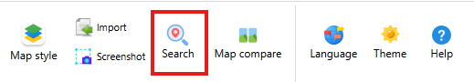
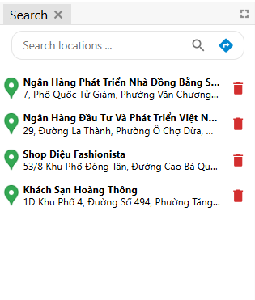
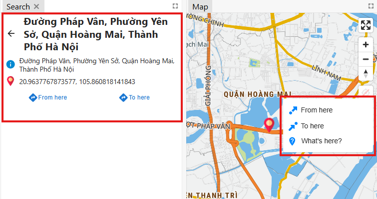
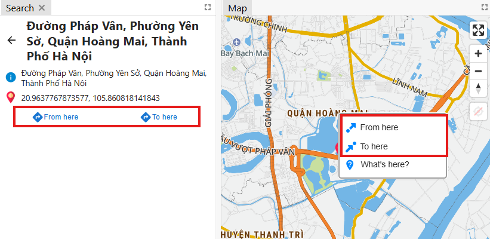
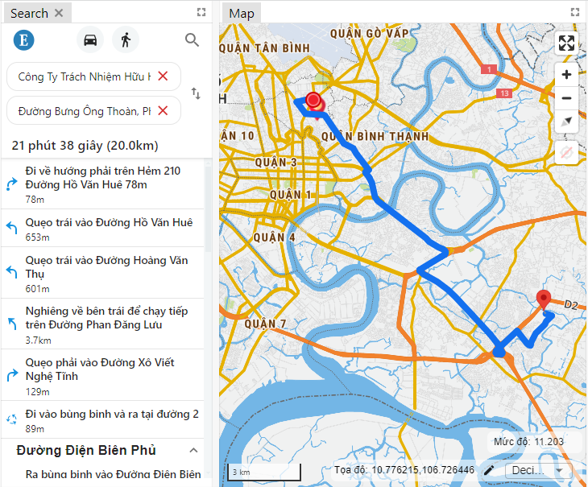

    Features: Search locations to show information and search directions.

    Actions: Click "Search" on toolbar in the Header, the Panel Search will show at the left.
    
 

    
## 1.Search locations

### Search by typing text
    
    Users search for addresses by entering relevant text in the search box. The first suggested results will appear below.

    After entering text, the user presses the Enter key or clicks on the magnifying glass icon to display multiple results and display the results on the map as below.

 

    Users click on a result to display detailed information of location :

    
    The selected location will be saved in the website's localStorage and displayed when opening the search page as follows:

### Find any information of location  on the map

    The user right-clicks at a desired point on the map, a dialog box containing options is displayed, the user clicks "_**Where is this?**_" to display information about that point in the adjacent window as shown below:

    

## 2.Search directions in Vietnam map

    The user selects "From here" or "To here" in the dialog box containing options after right-clicking on the map or below the location information displaying to specify the starting and ending points of the journey:

    After specifying two points, the system searches for a route through the two points and displays the journey including steps, completion time, and the length of journey in the window and displaying the road layer on the map:

